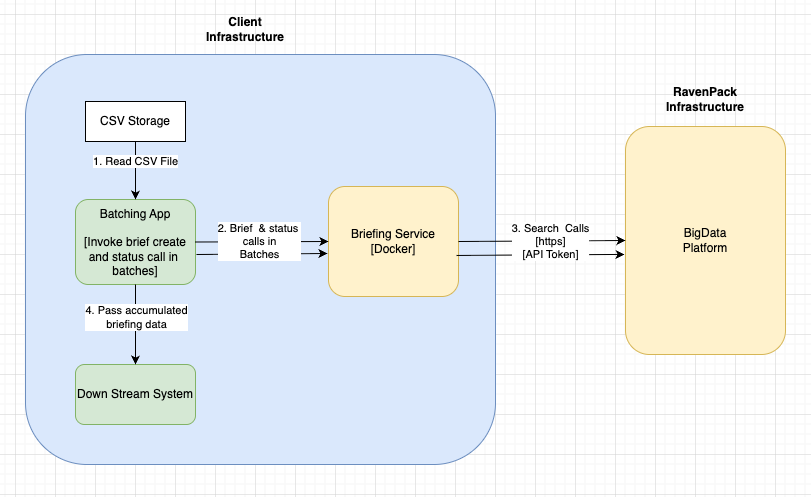

# Large-Scale Portfolio Briefs Generation

This project provides a comprehensive solution for generating briefing reports for large portfolios of companies using the Bigdata.com briefs service. It's designed for portfolio managers, analysts, and researchers who need to monitor hundreds or thousands of companies simultaneously.

## High Level Design 



## Features

- **Batch Processing**: Process hundreds or thousands of companies in configurable batches
- **CSV-Based Input**: Load company identifiers from CSV files for easy portfolio management
- **Customizable Topics**: Define research questions and topics tailored to your analysis needs
- **Progress Tracking**: Monitor batch processing with status polling and error handling
- **Multiple Export Formats**: Export results to JSON and Excel for further analysis
- **Source Attribution**: Full source metadata with URLs, headlines, and publication dates

## Prerequisites

### Service Deployment

**IMPORTANT**: This notebook requires the `bigdata-briefs` service to be deployed and running. The service provides the API endpoints used for generating briefs.

#### Deploying the bigdata-briefs Service

**Option 1: Use the pre-built Docker image (Recommended)**

Run the service directly from GitHub Container Registry - no need to clone the repository:

```bash
docker run -d \
  --name bigdata_briefs \
  -p 8000:8000 \
  -e BIGDATA_API_KEY=<your-bigdata-api-key> \
  -e OPENAI_API_KEY=<your-openai-api-key> \
  ghcr.io/bigdata-com/bigdata-briefs:latest
```

**Option 2: Build from source**

If you prefer to build from source:

1. **Clone the bigdata-briefs repository**:
   ```bash
   git clone https://github.com/Bigdata-com/bigdata-briefs.git
   cd bigdata-briefs
   ```

2. **Build and run the Docker container**:
   ```bash
   # Build the Docker image
   docker build -t bigdata_briefs .
   
   # Run the container
   docker run -d \
     --name bigdata_briefs \
     -p 8000:8000 \
     -e BIGDATA_API_KEY=<your-bigdata-api-key> \
     -e OPENAI_API_KEY=<your-openai-api-key> \
     bigdata_briefs
   ```

**Verify the service is running** (for both options):
- Access the API documentation at `http://localhost:8000/docs`
- The service should be accessible at `http://localhost:8000/`

**Optional: Enable access token security** (for both options):
   ```bash
   docker run -d \
     --name bigdata_briefs \
     -p 8000:8000 \
     -e BIGDATA_API_KEY=<your-bigdata-api-key> \
     -e OPENAI_API_KEY=<your-openai-api-key> \
     -e ACCESS_TOKEN=<your-access-token> \
     ghcr.io/bigdata-com/bigdata-briefs:latest
   ```

   If using an access token, set the `API_TOKEN` environment variable when running the notebook.

For more details on deploying the service, refer to the [bigdata-briefs README](https://github.com/Bigdata-com/bigdata-briefs/blob/main/README.md).

### Additional Requirements

- Python 3.8 or higher
- [uv](https://github.com/astral-sh/uv) package manager (recommended) or pip
- Bigdata.com API key
- OpenAI API key (for the briefs service)

All Python dependencies are listed in `requirements.txt` and will be installed automatically during setup.

## Installation and Usage

1. **Navigate to the project directory**:
   ```bash
   cd Briefs_Generation_Large_Scale
   ```

2. **Create a virtual environment** (choose one method):

   **Using uv** (recommended):
   ```bash
   # Install uv if not already installed
   curl -LsSf https://astral.sh/uv/install.sh | sh
   
   # Create virtual environment
   uv venv
   source .venv/bin/activate  # On Windows: .venv\Scripts\activate
   
   # Install dependencies
   uv pip install -r requirements.txt
   ```

   **Using pip**:
   ```bash
   # Create virtual environment
   python -m venv .venv
   source .venv/bin/activate  # On Windows: .venv\Scripts\activate
   
   # Install dependencies
   pip install -r requirements.txt
   ```

3. **Set up your API token** (if using access token security):
   ```bash
   export API_TOKEN=<your-access-token>
   # Or set TOKEN or API_KEY environment variables
   ```

4. **Prepare your company data**:
   - Place your CSV file in `static/data/` directory
   - Ensure the CSV contains a column named `RP_ENTITY_ID` with company identifiers
   - Update the notebook to reference your CSV filename if different from `US_Top1000.csv`

5. **Start JupyterLab**:
   ```bash
   jupyter lab
   ```

6. **Open and run the notebook**:
   - Open `portfolio_briefs_generation.ipynb`
   - Follow the step-by-step instructions in the notebook
   - Run cells sequentially to generate briefs

## Project Structure

```
Briefs_Generation_Large_Scale/
├── README.md                           # Project documentation
├── requirements.txt                    # Python dependencies
├── portfolio_briefs_generation.ipynb   # Main Jupyter notebook for brief generation
├── static/
│   └── data/
│       └── US_Top1000.csv             # Company identifiers CSV file
└── output/                            # Generated reports (created during execution)
    ├── briefs_request_summaries.json  # Request metadata and status
    └── combined_briefs_report.json    # Combined briefing reports
```

## Workflow Overview

The notebook implements a comprehensive workflow for large-scale brief generation:

1. **Load Company Identifiers**: Reads company IDs from CSV file (`static/data/US_Top1000.csv`)
2. **Define Research Topics**: Configure the questions/topics to research for each company
3. **Configure Batch Processing**: Set batch size, date ranges, and API settings
4. **Process in Batches**: Submit requests in batches and monitor progress
5. **Collect Results**: Aggregate all batch results into combined reports
6. **Export and Analyze**: Export to JSON and Excel formats for further analysis

## Configuration

### Key Settings

- **BATCH_SIZE**: Number of companies processed per request (recommended: 50 for production, max: 100)
  
  **Note:** Batching is not strictly necessary as the service can handle large numbers of companies in a single request. However, the batching approach shown in this notebook serves as a guideline for:
  - **Scheduling across time zones**: Distribute processing across different time zones to optimize resource usage
  - **Concurrent service execution**: Run multiple service instances concurrently to process different batches in parallel
  - **Customization possibilities**: Apply different topics or configurations to different batches, such as sector-specific topics for each batch
  
  You can set `BATCH_SIZE` to match the total number of companies if you prefer a single request.

- **report_start_date** / **report_end_date**: Time window for gathering information
- **TOPICS**: List of research questions/topics (customizable per company)
- **novelty**: Filter for only new or unique information
- **source_rank_boost** / **freshness_boost**: Control source prioritization

### Example Configuration

```python
BATCH_SIZE = 50
TOPICS = [
    "What notable changes in {company}'s financial performance metrics have been reported recently?",
    "Has {company} revised its financial or operational guidance for upcoming periods?",
    "What significant strategic initiatives or business pivots has {company} announced recently?",
]

payload = {
    "companies": companies,
    "report_start_date": "2025-10-27",
    "report_end_date": "2025-11-03",
    "novelty": True,
    "topics": TOPICS,
    "source_rank_boost": 10,
    "freshness_boost": 8,
    "disable_introduction": True,
}
```

## Output Files

The notebook generates two main output files:

1. **Request Summaries JSON** (`briefs_request_summaries.json`):
   - Metadata about each batch request
   - Status information (submitted, completed, failed, timeout)
   - Timestamps and entity counts
   - Error logs if any

2. **Combined Report JSON** (`combined_briefs_report.json`):
   - All entity reports with bullet points
   - Source metadata with URLs, headlines, and publication dates
   - Structured for programmatic access

3. **Excel Export** (optional):
   - Formatted spreadsheet with company information
   - Bullet points and source links
   - Easy to share and analyze

## Use Cases

- **Portfolio Monitoring**: Track hundreds of companies in your investment portfolio
- **Sector Analysis**: Generate briefs for entire sectors or industries
- **Watchlist Management**: Monitor large watchlists for market-moving events
- **Research Automation**: Automate research workflows for large company sets
- **Risk Assessment**: Identify risks and opportunities across large portfolios

## Best Practices

1. **Batch Size**: While batching is optional, using smaller batches (20-50) can help with testing, scheduling across time zones, running concurrent services, and applying different topics (e.g., sector-specific) to different batches
2. **Error Handling**: Monitor the request summaries JSON for any failed batches
3. **Date Ranges**: Use appropriate date ranges to balance coverage and processing time
4. **Topics**: Customize topics based on your specific research needs
5. **Service Monitoring**: Ensure the bigdata-briefs service is healthy before large runs

## Troubleshooting

### Service Connection Issues

- Verify the bigdata-briefs service is running: `curl http://localhost:8000/health`
- Check the API_URL in the notebook matches your service endpoint
- Ensure firewall/network settings allow connections to the service

### CSV Loading Errors

- Verify the CSV file is in `static/data/` directory
- Check that the CSV contains a column named `RP_ENTITY_ID`
- Ensure the CSV file is properly formatted (no encoding issues)

### Batch Processing Failures

- Check the request summaries JSON for error details
- Verify API keys are correctly set in the service environment
- Monitor service logs for any backend issues
- Reduce batch size if experiencing timeouts

### Memory Issues

- Process companies in smaller batches
- Clear intermediate variables if processing very large datasets
- Consider processing in separate notebook sessions

## Support

For issues related to:
- **This notebook**: Check the notebook cells for detailed error messages
- **bigdata-briefs service**: Refer to [bigdata-briefs documentation](https://github.com/Bigdata-com/bigdata-briefs)
- **Bigdata.com API**: Visit [Bigdata.com documentation](https://docs.bigdata.com)

## License

See the LICENSE file in the parent directory for license information.

