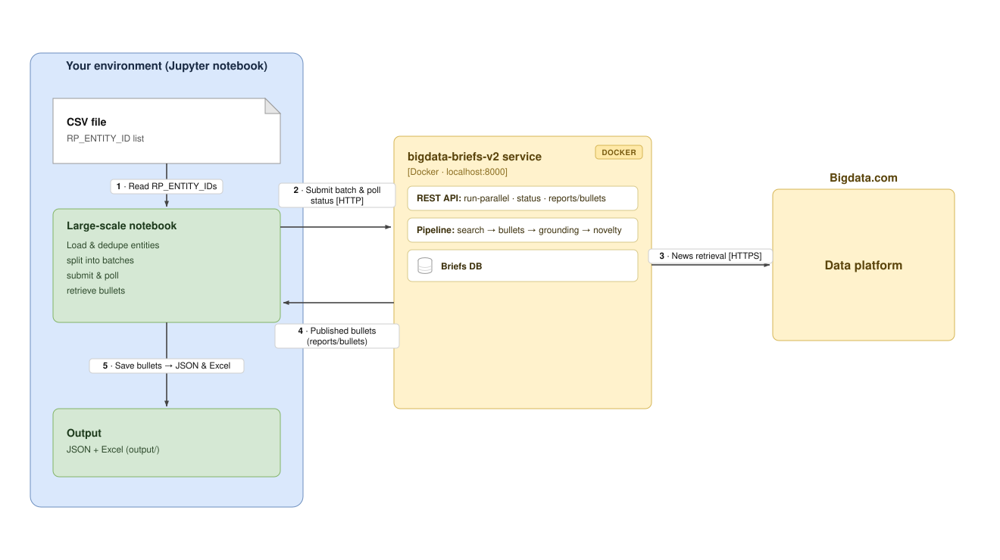

# Large-Scale Portfolio Briefs Generation (V2)

This project lets you test **Bigdata Briefs v2** at scale: it drives the briefs service's REST API to generate structured, novelty-filtered brief reports for a large portfolio of companies, monitors each batch to completion, retrieves the generated bullet points, and exports everything to JSON and Excel. It's designed for portfolio managers, analysts, and researchers who need to monitor hundreds or thousands of companies at once.

The notebook (`portfolio_briefs_generation_v2.ipynb`) talks to the v2 pipeline through three endpoints: it submits batches with `run-parallel`, polls `batch/parallel/{batch_id}/status`, and reads results with `reports/bullets`.

## High Level Design



## Features

- **Batch Processing**: Process hundreds or thousands of companies in configurable batches
- **CSV-Based Input**: Load company identifiers (`RP_ENTITY_ID`) from CSV files for easy portfolio management
- **Novelty-Filtered Bullets**: The v2 pipeline filters every bullet for relevance and novelty across runs, so you only see materially new developments
- **Progress Tracking**: Monitor batch processing with status polling and error handling
- **Multiple Export Formats**: Export results to JSON and Excel for further analysis
- **Source Attribution**: Full citation metadata per bullet (source name, headline, chunk text, URL) plus novelty metadata (`search_action`, `is_fully_novel`)

## Prerequisites

### Service Deployment

**IMPORTANT**: This notebook requires the **bigdata-briefs-v2** service to be deployed and running. The service exposes the API endpoints used to generate and retrieve briefs.

Clone the repository first:

```bash
git clone https://github.com/Bigdata-com/bigdata-briefs-v2.git
cd bigdata-briefs-v2
```

Then pick one of the two options below.

**Option 1: Docker (recommended)**

```bash
docker build -t bigdata_briefs .

docker run -d \
  --name bigdata_briefs \
  -p 8000:8000 \
  -e BIGDATA_API_KEY=<your-bigdata-api-key> \
  -e OPENAI_API_KEY=<your-openai-api-key> \
  bigdata_briefs
```

Or, using the bundled compose file (API only, no cron). Compose reads the keys from a `.env` file, so create it first:

```bash
cp .env.example .env
# Edit .env to set BIGDATA_API_KEY and OPENAI_API_KEY
docker compose up -d --build
```

**Option 2: uv (no Docker)**

```bash
uv sync
cp .env.example .env
# Edit .env to set BIGDATA_API_KEY and OPENAI_API_KEY
uv run uvicorn bigdata_briefs.api.app:app --host 0.0.0.0 --port 8000
```

**Verify the service is running** (both options):

```bash
curl http://localhost:8000/health
```

Interactive API docs are available at `http://localhost:8000/docs` only when the service is started with `ENABLE_DOCS=1` (off by default).

For local testing no authentication is needed. (For a shared or public deployment you would protect the API with `PUBLIC_MODE` / `PIPELINE_API_KEY`; see the [bigdata-briefs-v2 README](https://github.com/Bigdata-com/bigdata-briefs-v2/blob/main/README.md).)

### Additional Requirements

- Python 3.9 or higher
- [uv](https://github.com/astral-sh/uv) package manager (recommended) or pip
- Bigdata.com API key
- OpenAI API key (used by the briefs service)

All Python dependencies for the notebook are listed in `requirements.txt` and will be installed during setup.

## Installation and Usage

1. **Navigate to the project directory**:
   ```bash
   cd Briefs_v2_Generation_Large_Scale
   ```

2. **Create a virtual environment** (choose one method):

   **Using uv** (recommended):
   ```bash
   # Install uv if not already installed
   curl -LsSf https://astral.sh/uv/install.sh | sh

   # Create virtual environment
   uv venv
   source .venv/bin/activate  # On Windows (PowerShell): .venv\Scripts\Activate.ps1

   # Install dependencies (ipykernel registers the Jupyter kernel)
   uv pip install -r requirements.txt ipykernel
   ```

   **Using pip**:
   ```bash
   # Create virtual environment
   python -m venv .venv
   source .venv/bin/activate  # On Windows (PowerShell): .venv\Scripts\Activate.ps1

   # Install dependencies
   pip install -r requirements.txt ipykernel
   ```

3. **Prepare your company data**:
   - Place your CSV file in the `static/data/` directory
   - Ensure the CSV contains a column named `RP_ENTITY_ID` with Bigdata entity identifiers
   - The notebook reads `static/data/US_100.csv` by default; update `CSV_PATH` in the notebook to point at your own file

4. **Start JupyterLab** (from this directory, so the relative paths resolve):
   ```bash
   jupyter lab portfolio_briefs_generation_v2.ipynb
   ```

5. **Run the notebook**:
   - Run the cells sequentially, following the step-by-step instructions
   - Steps 1-4 (load CSV, configure, set output paths, define helpers) run without the service; from Step 5 (Run Brief V2 Batches Sequentially) onward, the service must be reachable at `http://localhost:8000`

## Project Structure

```
Briefs_v2_Generation_Large_Scale/
├── README.md                              # Project documentation
├── requirements.txt                       # Python dependencies (notebook side)
├── portfolio_briefs_generation_v2.ipynb   # Brief V2 large-scale notebook
├── static/
│   ├── data/
│   │   └── US_100.csv                     # Company identifiers CSV (RP_ENTITY_ID column)
│   └── media/
│       └── bigdata-briefs-v2-architecture.svg  # High-level diagram
└── output/                                # Generated artifacts (created at runtime)
    ├── brief_v2_batch_summaries.json      # Per-batch submission + status metadata
    ├── brief_v2_first5_bullets.json       # Raw bullets for the first 5 entities (preview)
    ├── brief_v2_all_bullets.json          # Raw bullets for all entities
    └── portfolio_briefs_generation_v2.xlsx # Flattened bullets, one row per bullet
```

## Workflow Overview

The notebook implements an end-to-end workflow for large-scale Brief V2 generation:

1. **Load Company Identifiers**: Read `RP_ENTITY_ID` values from the CSV, deduplicate, and build the entity list
2. **Configure Batch Processing**: Set the API endpoints, batch size, and the report window
3. **Set Output Folder and File Names**: Prepare `output/` and the V2-specific file names
4. **Define Helpers**: API calls, status polling, JSON persistence, and citation formatting
5. **Run Batches Sequentially**: Submit one `run-parallel` batch at a time and poll its status until every entity has succeeded or failed
6. **Retrieve Preview Bullets**: Fetch bullets for the first 5 entities and save the raw response
7. **Display Preview Results**: Render the first 5 entities' bullets, citations, and discard counts
8. **Retrieve All Bullets and Export**: Fetch bullets for all entities, persist the combined JSON, and export a flattened Excel workbook

## Configuration

### Key Settings

- **BATCH_SIZE**: Number of companies submitted per `run-parallel` call. The service caps how many entities run concurrently via `MAX_CONCURRENT_ENTITIES` (default 10), regardless of batch size.

  **Note:** A single `run-parallel` call can accept a large entity list, so batching is not strictly required. The batching approach in this notebook is a guideline for:
  - **Scheduling across time zones**: distribute processing to optimize resource usage
  - **Concurrent service instances**: run multiple service instances (each with its own Bigdata key and 450 QPM budget) to process different batches in parallel
  - **Per-batch customization**: apply different windows or categories to different batches

- **FORCE_WINDOW_START** / **FORCE_WINDOW_END**: The report window for the run. **A 24-hour window is the recommended baseline** — one day at a time produces the sharpest bullets and the most reliable novelty comparisons. Wider windows degrade on four axes: prompt size (larger prompts risk hitting context limits), search coverage (each query has a result cap, so some developments are missed), cost (roughly proportional to news volume), and temporal coherence (multi-week windows mix different states of a developing situation). For multi-day or historical ranges, prefer the service's `POST /api/v1/scan` endpoint, which splits the range into windows and processes them sequentially, producing a separate brief per window.
- **POLL_INTERVAL_SECONDS** / **BATCH_TIMEOUT_SECONDS**: How often to poll batch status, and the per-batch timeout.

### Example Configuration

```python
BATCH_SIZE = 50
companies = ids  # loaded from static/data/US_100.csv

API_BASE_URL = "http://localhost:8000"
RUN_PARALLEL_URL = f"{API_BASE_URL}/api/v1/batch/run-parallel"
BULLETS_URL      = f"{API_BASE_URL}/api/v1/reports/bullets"

# Single-day window (recommended baseline)
FORCE_WINDOW_START = "2026-02-01T00:00:00"
FORCE_WINDOW_END   = "2026-02-01T23:59:59"

# Payload submitted per batch
payload_batch = {
    "entity_ids": batch,
    "force_window_start": FORCE_WINDOW_START,
    "force_window_end": FORCE_WINDOW_END,
}
```

The pipeline discovers themes, scores relevance, validates grounding, and filters novelty automatically, so the only inputs you provide are the entities and the window. Optional flags you can add to the payload include `generate_narrative`, `ranking_metric`, `categories`, and `force_overlap` (see the service README).

## Output Files

The notebook writes everything under `output/`:

1. **Batch Summaries JSON** (`brief_v2_batch_summaries.json`): per-batch metadata (batch id, entity ids, submission/completion timestamps, final status, and the polled status response).
2. **Preview Bullets JSON** (`brief_v2_first5_bullets.json`): the raw `reports/bullets` response for the first 5 entities.
3. **All Bullets JSON** (`brief_v2_all_bullets.json`): the combined raw response for every entity, plus per-batch retrieval metadata.
4. **Excel Export** (`portfolio_briefs_generation_v2.xlsx`): one row per bullet, with entity/run metadata, bullet text, novelty decisions (`embedding_decision`, `search_action`, `is_fully_novel`), and flattened citations (ids, headlines, sources, texts).

## Use Cases

- **Portfolio Monitoring**: Track hundreds of companies in your investment portfolio
- **Sector Analysis**: Generate briefs for entire sectors or industries
- **Watchlist Management**: Monitor large watchlists for market-moving events
- **Research Automation**: Automate research workflows for large company sets
- **Risk Assessment**: Identify risks and opportunities across large portfolios

## Best Practices

1. **Window size**: Keep the window at 24 hours for the sharpest bullets and most reliable novelty comparisons. For multi-day historical backfills, prefer the service's `scan` endpoint over a single wide `run-parallel` window.
2. **Throughput & concurrency**: Parallel entities share a process-wide 450 QPM Bigdata budget and `MAX_CONCURRENT_ENTITIES` (default 10). To go faster at universe scale, run multiple service instances, each with its own Bigdata API key.
3. **Error handling**: Monitor `brief_v2_batch_summaries.json` for any `submit_failed` / `timeout` batches.
4. **Re-runs**: The service rejects a window that overlaps an already-completed run for the same entity (see Troubleshooting).
5. **Service monitoring**: Confirm the service is healthy (`/health`) before launching large runs.

## Troubleshooting

### Service Connection Issues

- Verify the service is running: `curl http://localhost:8000/health`
- Make sure the notebook and the service are on the **same host**. If you run the notebook on Linux/WSL and the service in Docker Desktop on Windows (or vice versa), `localhost:8000` may not bridge between them.
- Check that `API_BASE_URL` in the notebook matches your service endpoint.

### Batch Completes Instantly / No New Bullets

If a batch reports "complete" in a few seconds with no real processing, the requested window most likely **overlaps an already-completed run** for those entities — the service rejects overlapping windows instead of re-running them (no API or LLM calls are made). To reprocess a window you have already run:

- Clear just that date: `POST /api/v1/utilities/delete-date` with `{"date": "YYYY-MM-DD"}`, then re-run.
- Or wipe the database: `POST /api/v1/utilities/reset-db?confirm=true`, then re-run.
- Or add `"force_overlap": true` to the `run-parallel` payload to bypass the check.

### CSV Loading Errors

- Verify the CSV file is in `static/data/`
- Check that it contains a column named `RP_ENTITY_ID`
- Ensure the file is UTF-8 encoded and well-formed

### All Bullets Discarded

This is expected when an entity has no materially new information in the requested window relative to prior runs. Try a different date or an entity with more news activity.

## Support

For issues related to:
- **This notebook**: check the cell output for detailed error messages
- **bigdata-briefs-v2 service**: see the [bigdata-briefs-v2 documentation](https://github.com/Bigdata-com/bigdata-briefs-v2)
- **Bigdata.com API**: visit [Bigdata.com documentation](https://docs.bigdata.com)

## License

See the LICENSE file in the parent directory for license information.
