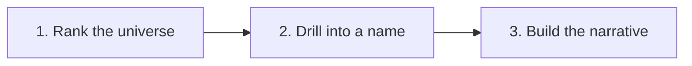

# Credit Factor Analysis

## Screen, Drill, and Discover Credit-News Narratives

A credit-analyst workflow built on three [Bigdata.com](https://bigdata.com) MCP tools and an LLM (`gpt-5.6-terra`). Rank a coverage universe by credit-news sentiment, drill into the worst name's catalysts, then turn those catalysts plus supporting news into a grounded narrative.



| Step | Tool | What it does |
|---|---|---|
| 1. Rank the universe | `bigdata_screen_credit_factor` | Negative screen across a portfolio or sector list, worst names first. |
| 2. Drill into a name | `bigdata_get_credit_factor` | One name's most extreme catalyst rows, by event type. |
| 3. Build the narrative | Your LLM + `bigdata_search` | News evidence + catalyst rows → why the score moved, what to watch next. |

The demo universe is a mix of mega-cap tech and staples (Apple, Microsoft, Alphabet, Amazon, Meta, Nvidia, Tesla, Walmart, Coca-Cola, and others). Swap that list in the notebook for your own portfolio or sector coverage.

The notebook talks to the Bigdata.com Remote MCP server (`https://mcp.bigdata.com/`) as a standard MCP client over Streamable HTTP, authenticated with `x-api-key`.

## Features

- **Universe ranking** on credit-news sentiment (`MEAN_CREDIT_SENTIMENT`, weekly or daily horizon)
- **Catalyst drill-down** for the deteriorating name, including both negative and positive event types
- **News evidence retrieval** via `bigdata_search` for the top negative catalysts
- **LLM narrative** explaining what moved, why it matters for credit, and what to watch next
- **Reusable coverage list** — change the company names in the notebook and re-run

## Installation and Usage

### Option 1: Docker Installation

#### Prerequisites

- Docker installed on your system

#### Setup and Run with Docker

1. **Clone and navigate to the project**:
   ```bash
   cd "Credit_Factor_Analysis"
   ```

2. **Set up credentials**:
   - Copy the example environment file:
     ```bash
     cp .env.example .env
     ```
   - Edit `.env` and add:
     ```
     BIGDATA_API_KEY=your_api_key_here
     OPENAI_API_KEY=your_openai_api_key
     ```

3. **Build and run the Docker container**:
   ```bash
   docker build -t credit-factor-analysis .

   docker run -u "$(id -u):$(id -g)" -e HOME=/app -p 8888:8888 --env-file .env -v "$(pwd)":/app credit-factor-analysis
   ```

4. **Access JupyterLab**:
   - Open `http://localhost:8888`
   - Open `Credit_Factor_Analysis.ipynb`
   - Run cells sequentially

### Option 2: Local Installation

#### Prerequisites

- Python 3.11 or higher
- [uv](https://github.com/astral-sh/uv) package manager
- A [Bigdata.com](https://bigdata.com) API key
- An OpenAI API key with access to `gpt-5.6-terra`

#### Setup and Run

1. **Install uv** (if not already installed):
   ```bash
   curl -LsSf https://astral.sh/uv/install.sh | sh
   ```

2. **Clone and navigate to the project**:
   ```bash
   cd "Credit_Factor_Analysis"
   ```

3. **Create a virtual environment and install dependencies**:
   ```bash
   uv venv
   source .venv/bin/activate  # On Windows: .venv\Scripts\activate
   uv pip install -r requirements.txt
   uv pip install jupyterlab
   ```

4. **Set up credentials**:
   ```bash
   cp .env.example .env
   ```
   Edit `.env` and add `BIGDATA_API_KEY` and `OPENAI_API_KEY`.

5. **Start JupyterLab**:
   ```bash
   jupyter lab
   ```

6. **Open the notebook**:
   - Open `Credit_Factor_Analysis.ipynb`
   - Run cells sequentially from top to bottom

## Project Structure

```
Credit_Factor_Analysis/
├── README.md                       # Project documentation
├── Credit_Factor_Analysis.ipynb    # Main Jupyter notebook
├── requirements.txt                # Python dependencies
├── Dockerfile                      # Docker container configuration
├── .dockerignore                   # Docker ignore patterns
├── .env.example                    # Example environment variables
└── src/
    ├── bigdata_mcp_client.py       # Async client for the Bigdata.com Remote MCP server
    └── narrative.py                # Prompt construction + LLM call for Step 3
```

## Key Components

- **Credit_Factor_Analysis.ipynb**: End-to-end screen → drill → narrative walkthrough
- **src/bigdata_mcp_client.py**: MCP session lifecycle plus `find_securities`, `bigdata_screen_credit_factor`, `bigdata_get_credit_factor`, and `bigdata_search`
- **src/narrative.py**: Prompt construction and `gpt-5.6-terra` synthesis from catalyst rows and news evidence

## Usage Notes

- Ensure credentials are set in `.env` before running
- Run the notebook sequentially from top to bottom
- Change the company list and `HORIZON` (`daily`, `weekly`, or `monthly`) to reuse the workflow on another universe
- Flip `screen_direction` to `"positive"` to find improving credit-news stories instead
