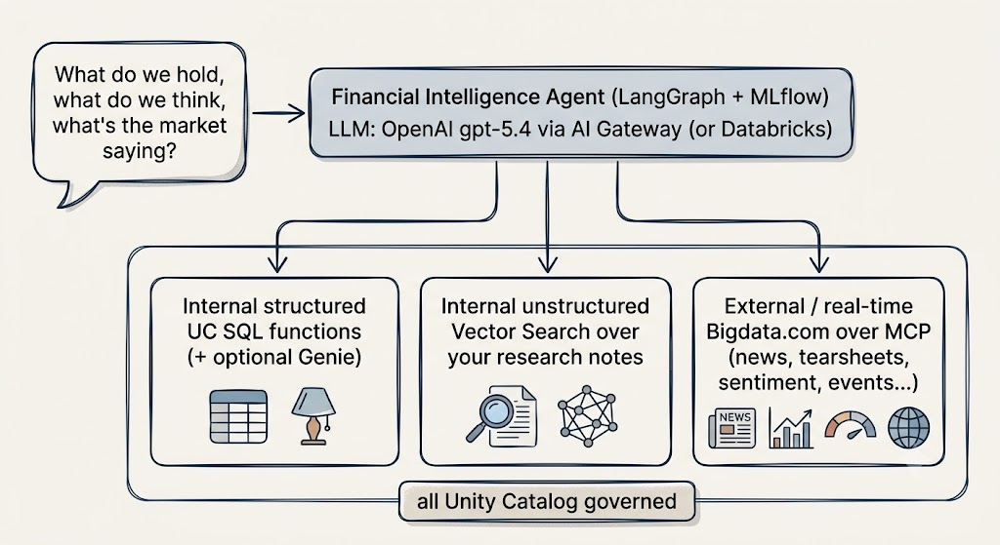
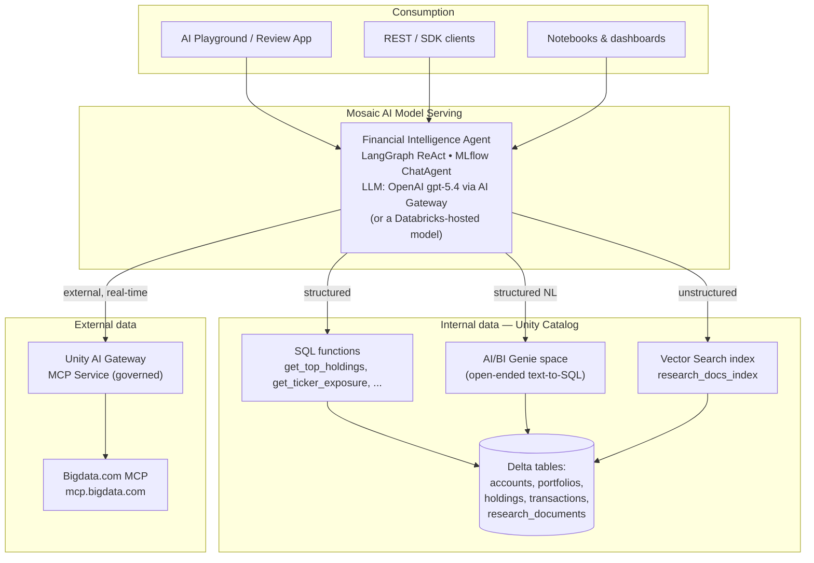

# Databricks + Bigdata.com MCP — Financial Intelligence Agent



Build one **Mosaic AI agent** on Databricks that answers financial questions by reasoning
over three data sources in a single conversation:

- **Internal structured data** — portfolio accounts, holdings, transactions (Unity Catalog + AI/BI Genie)
- **Internal unstructured data** — the firm's proprietary research notes (Mosaic AI Vector Search)
- **External real-time intelligence** — news, filings, transcripts, tearsheets, events from [Bigdata.com](https://bigdata.com) over **MCP**

Built on the latest Databricks
agent stack: **Unity Catalog governance, Vector Search, AI/BI Genie, Model Context Protocol
via Unity AI Gateway, the Mosaic AI Agent Framework, and MLflow 3.**

---

## Why this matters

Your analysts already have proprietary data in the lakehouse and a firehose of external market
intelligence outside it. The value is in the *join* — "what do **we** hold, what do **we**
think, and what is the **market** saying right now?" — answered in one place, with governance
and citations.

The **Model Context Protocol (MCP)** is the piece that makes the external half clean.
Instead of hand-coding an API wrapper per capability, the agent connects once to
Bigdata.com's MCP server and **discovers its tools automatically** — `bigdata_search`,
`find_securities`, `bigdata_company_tearsheet`, `bigdata_sentiment_tearsheet`,
`bigdata_events_calendar`, and more. New Bigdata.com tools show up in the agent with zero
code changes. Databricks now governs those
external tools through **Unity AI Gateway**, so an outside API gets the same permissioning,
credential management, and audit trail as a Delta table.

---

## Architecture



The agent picks the right tool per sub-question, then synthesizes a single cited answer.

---

## Tools available to the agent in Databricks

| Tool | Type | Source | Example question |
|---|---|---|---|
| `get_top_holdings`, `get_portfolio_positions`, `get_ticker_exposure` | Internal structured | Unity Catalog SQL functions | *"Top 5 holdings by market value?"* |
| `query_portfolio_genie` *(optional)* | Internal structured | AI/BI Genie space | *"Compare AUM by account type"* |
| `search_internal_research` | Internal unstructured | Vector Search | *"Our thesis on NVIDIA?"* |
| `bigdata_search` | External | Bigdata.com MCP | *"Latest Apple earnings news"* |
| `find_securities` | External | Bigdata.com MCP | *"Resolve Tesla / an ETF / a fund"* |
| `get_securities` | External | Bigdata.com MCP | *"Batch-resolve these ISINs"* |
| `bigdata_company_tearsheet` | External | Bigdata.com MCP | *"Microsoft financial tearsheet"* |
| `bigdata_etf_tearsheet` | External | Bigdata.com MCP | *"Holdings of the SOXX ETF"* |
| `bigdata_sentiment_tearsheet` | External | Bigdata.com MCP | *"Media sentiment on NVIDIA"* |
| `bigdata_events_calendar` | External | Bigdata.com MCP | *"Upcoming earnings for our holdings"* |
| `bigdata_country_tearsheet` / `bigdata_market_tearsheet` | External | Bigdata.com MCP | *"US macro / cross-asset snapshot"* |
| `bigdata_screen_credit_factor` / `bigdata_screen_fund_managers` | External | Bigdata.com MCP | *"Credit-factor / ownership screen"* |
| *(any new Bigdata.com tool)* | External | Bigdata.com MCP | auto-discovered over MCP |


---

## Prerequisites

- A Databricks workspace with **Unity Catalog** and **Serverless** enabled (any cloud) —
  [Databricks Free Edition](https://www.databricks.com/learn/free-edition) works and is free.
- An **LLM endpoint** for the agent. The default is an **OpenAI `gpt-5.4`** external-model
  endpoint governed by AI Gateway — see [Set up the agent's LLM](#set-up-the-agents-llm-openai-via-ai-gateway)
  below (needs an OpenAI API key). To use a Databricks-hosted model instead, set
  `LLM_ENDPOINT` to e.g. `databricks-claude-sonnet-4-5`.
- The **`databricks-gte-large-en`** embeddings endpoint (or any equivalent your workspace has).
- Permission to create a catalog, a Vector Search endpoint, and Model Serving endpoints.
- The **Databricks CLI** configured (`databricks auth login`) for secrets and — on the
  governed path — the MCP Service registration.
- A **Bigdata.com API key** — [platform.bigdata.com/api-keys](https://platform.bigdata.com/api-keys).

---

## Files

| File | What it does |
|---|---|
| `00_setup.ipynb` | Create the Unity Catalog catalog/schema; store the Bigdata.com API key as a secret |
| `01_internal_data.ipynb` | Load portfolio Delta tables + research documents; create the structured SQL-function tools |
| `02_vector_search.ipynb` | Build the Vector Search index over internal research |
| `03_bigdata_mcp_setup.ipynb` | Connect Bigdata.com MCP — governed (AI Gateway MCP Service) and direct paths, with a live connectivity test |
| `04_genie_space.md` | *(Optional)* Create an AI/BI Genie space for open-ended structured Q&A |
| `agent.py` | The agent model — LangGraph ReAct + MLflow `ChatAgent`, combining all three sources |
| `05_build_deploy_agent.ipynb` | Test locally, log with resources, register to UC, deploy to Model Serving |
| `06_cleanup.ipynb` | Remove demo objects |
| `requirements.txt` / `.env.example` | Dependencies and configuration reference |

Import the whole folder into Databricks as a **Repo** (Git folder), or import the `.ipynb`
files individually as notebooks. `agent.py` stays a Python module — it is imported by
`05_build_deploy_agent` and packaged by MLflow, not run as a notebook.

---

## Quickstart

```
00_setup  →  01_internal_data  →  02_vector_search  →  03_bigdata_mcp_setup
          →  (04_genie_space, optional)  →  05_build_deploy_agent
```

0. **LLM** — set up the agent's model (see [below](#set-up-the-agents-llm-openai-via-ai-gateway)):
   store your OpenAI key as a secret and create the `openai-chat` (gpt-5.4) external-model
   endpoint. (`00_setup` does this for you — skip if you point `LLM_ENDPOINT` at a
   Databricks-hosted model instead.)
1. **`00_setup`** — set `CATALOG`/`SCHEMA`, create them, and store your keys:
   ```bash
   databricks secrets create-scope bigdata
   databricks secrets put-secret bigdata api_key        --string-value "bd-...bigdata-key..."
   databricks secrets put-secret bigdata openai_api_key --string-value "sk-...openai-key..."
   ```
2. **`01_internal_data`** — run all cells. Creates tables + the 3 SQL-function tools.
3. **`02_vector_search`** — run all cells. Builds `research_docs_index` (a few minutes the
   first time the endpoint spins up).
4. **`03_bigdata_mcp_setup`** — run **Path B** cells to confirm your API key works and to
   see the tools Bigdata.com exposes. Optionally follow **Path A** to register the governed
   MCP Service.
5. *(Optional)* **`04_genie_space`** — create a Genie space and set `USE_GENIE=True` /
   `GENIE_SPACE_ID` in `agent.py` + `05`.
6. **`05_build_deploy_agent`** — test locally, then log → register → deploy. Chat in the
   **AI Playground** or via the SDK.

---

## Set up the agent's LLM (OpenAI via AI Gateway)

The agent defaults to **OpenAI `gpt-5.4`**, served through a Databricks **AI Gateway
external-model endpoint** — your OpenAI key stays in a Databricks secret (never in code or
the model artifact), and you get AI Gateway's rate-limit / usage controls. `00_setup.ipynb`
automates the two steps below; this is the reference if you're doing it manually or need to
troubleshoot.

> **Model id:** use the exact id your OpenAI account exposes. `gpt-5.4` is the default here;
> any OpenAI chat model with tool/function calling works (e.g. `gpt-4.1`, `gpt-4o`) — just
> change the one string in the endpoint config below.

**1. Store your OpenAI key as a Databricks secret** (reuses the `bigdata` scope):
```bash
databricks secrets put-secret bigdata openai_api_key --string-value "sk-...your-openai-key..."
```

**2. Create the external-model endpoint** — run once in a Databricks notebook cell:
```python
from databricks.sdk import WorkspaceClient
from databricks.sdk.service.serving import (
    EndpointCoreConfigInput, ServedEntityInput, ExternalModel, OpenAiConfig,
)

WorkspaceClient().serving_endpoints.create(
    name="openai-chat",
    config=EndpointCoreConfigInput(
        served_entities=[
            ServedEntityInput(
                name="gpt-openai",
                external_model=ExternalModel(
                    name="gpt-5.4",                 # <-- exact OpenAI model id
                    provider="openai",
                    task="llm/v1/chat",
                    openai_config=OpenAiConfig(
                        openai_api_key="{{secrets/bigdata/openai_api_key}}",
                    ),
                ),
            )
        ]
    ),
)
```
Or via the UI: **Serving → Create serving endpoint → External model → Provider: OpenAI**,
point the API key at `{{secrets/bigdata/openai_api_key}}`, set the model, name the endpoint
`openai-chat`.

**3. Point the agent at it** — already the default in `agent.py` and `05`'s config cell:
```python
LLM_PROVIDER = "databricks"     # calls the endpoint via ChatDatabricks
LLM_ENDPOINT = "openai-chat"
```
No OpenAI library or key touches the agent process; `05` already declares
`DatabricksServingEndpoint(endpoint_name="openai-chat")` as a resource so the deployed agent
is granted access automatically. *(Optional)* set a rate limit under **Serving → openai-chat
→ AI Gateway → Rate limits**.

**Alternative — call OpenAI directly** (skip the endpoint): set `LLM_PROVIDER = "openai"` and
`OPENAI_MODEL = "gpt-5.4"` in `agent.py`, `%pip install langchain-openai`, and for deployment
add `"OPENAI_API_KEY": "{{secrets/bigdata/openai_api_key}}"` to the `environment_vars` in
`05`'s `agents.deploy(...)` call. The external-model endpoint above is the recommended path.

---

## Two ways to connect Bigdata.com (choose in `agent.py`)

`agent.py` has a single switch, `USE_MCP_SERVICE`:

- **`False` — Direct** (default, simplest). The agent connects straight to
  `https://mcp.bigdata.com/` using `langchain-mcp-adapters`, authenticating with the
  `x-api-key` header pulled from the Databricks secret. On the deployed endpoint the key is
  injected as a **secret-backed environment variable** (`{{secrets/bigdata/api_key}}`).
- **`True` — Governed MCP Service** (recommended for shared/production). Bigdata.com is
  registered behind a Unity Catalog HTTP connection and exposed through **Unity AI Gateway**.
  Callers need only `EXECUTE` on the service; the API key stays inside Unity Catalog and every
  call is audited. See Path A in `03_bigdata_mcp_setup.ipynb`.

Both paths use the same agent code and the same downstream demo — only the switch changes.

---

## Cross-source demo questions

These are the questions worth showing — no single system can answer them alone. They also
exercise the newer Bigdata.com tools (sentiment, events calendar, ETF/country/market
tearsheets, credit and ownership screeners):

**Classic internal × external**
- *"What is our largest NVDA holding? Compare our internal thesis with the latest NVIDIA news
  from Bigdata.com."*
- *"Which tickers have the highest unrealized P&L? Pull recent Bigdata.com news on the top
  performer."*
- *"What does our risk assessment say about China exposure? Find the latest Bigdata.com news
  on China semiconductor export policy."*

**Sentiment & catalysts**
- *"For our top 5 holdings, pull the Bigdata.com media sentiment for each and flag any where
  sentiment is turning negative versus our internal thesis."*
- *"Which of our holdings report earnings in the next two weeks? Use the Bigdata.com events
  calendar, then summarize the setup for the two largest positions."*

**Macro & cross-asset context**
- *"Our AI & Semiconductor portfolio is aggressive — give me a Bigdata.com country tearsheet
  for the US and a cross-asset market snapshot, then tell me which of our positions are most
  macro-sensitive."*
- *"Compare our concentrated NVDA exposure with the holdings of a major semiconductor ETF
  via the Bigdata.com ETF tearsheet — are we more or less concentrated than the index?"*

**Risk & ownership**
- *"Screen our holdings for credit-factor risk using Bigdata.com, and cross-reference the
  flags with our internal risk assessment."*
- *"Who are the largest institutional holders of our top position (Bigdata.com fund-manager
  screen), and does that crowding change our risk view?"*

`05_build_deploy_agent.ipynb` lists more, grouped by data source.

---

## Governance & security notes

- **Credentials never touch code.** The API key lives in a Databricks secret (direct path) or
  inside a Unity Catalog connection (governed path). The logged model artifact contains no key.
- **Least privilege on the external tool.** On the governed path, business users get `EXECUTE`
  on the MCP Service and nothing on the underlying connection — they can *use* Bigdata.com
  through the agent without ever seeing the key or hitting the endpoint directly.
- **Auditability & lineage.** Unity Catalog tracks the tables, functions, vector index, and
  the deployed model; AI Gateway logs every external MCP call.
- **Cited answers.** The system prompt requires inline citations and a numbered `Sources`
  section for every Bigdata.com-derived claim.

---

## Troubleshooting

| Symptom | Cause / fix |
|---|---|
| `Secret not found` in `00` | Create the scope/key with the Databricks CLI, then re-run the cell |
| MCP `401` / `403` in `03` | Bad or expired API key — regenerate at [platform.bigdata.com/api-keys](https://platform.bigdata.com/api-keys) and update the secret |
| `Endpoint openai-chat not found` | Create the OpenAI external-model endpoint (see [Set up the agent's LLM](#set-up-the-agents-llm-openai-via-ai-gateway) above), or set `LLM_ENDPOINT` to a Databricks foundation-model endpoint you have |
| LLM rate-limit errors | Databricks-hosted foundation endpoints are rate-limited on Free Edition — use your own OpenAI key (see [Set up the agent's LLM](#set-up-the-agents-llm-openai-via-ai-gateway)) and set limits in AI Gateway |
| Vector index build hangs | The endpoint is still provisioning — first creation takes several minutes; re-run to trigger a sync |
| Deployed agent can't reach Bigdata.com | On the direct path, confirm the endpoint has the `BIGDATA_API_KEY` secret-backed env var (step 3 of `05`) |
| `EXECUTE denied` on MCP Service | Grant `EXECUTE ON MCP SERVICE …` to the agent's service principal / users |
| Genie tool errors | Ensure `GENIE_SPACE_ID` is set and the agent's principal has `CAN RUN` on the space |

---

## Reference links

### Bigdata.com
- [Bigdata.com](https://bigdata.com) · [API docs](https://docs.bigdata.com/) · [MCP reference](https://docs.bigdata.com/mcp-reference/introduction)
- [MCP tool: find_securities](https://docs.bigdata.com/mcp-reference/tools/find-companies) (replaces `find_companies`)
- [Developer platform / API keys](https://platform.bigdata.com/api-keys)

### Databricks
- [Build AI agents on Databricks (hub)](https://docs.databricks.com/aws/en/agents)
- [Use MCP servers in agents](https://docs.databricks.com/aws/en/agents/mcp/use-mcp-in-agents)
- [Connect agents to third-party tools with MCP Services](https://docs.databricks.com/aws/en/agents/agent-framework/mcp-services)
- [Databricks managed MCP servers](https://docs.databricks.com/aws/en/agents/mcp/managed-mcp)
- [Connect agents to unstructured data (Vector Search)](https://docs.databricks.com/aws/en/agents/agent-framework/unstructured-retrieval-tools)
- [Create AI agent tools using Unity Catalog functions](https://docs.databricks.com/aws/en/generative-ai/agent-framework/create-custom-tool)
- [AI/BI Genie](https://docs.databricks.com/aws/en/genie/)
- [databricks-langchain API](https://api-docs.databricks.com/python/databricks-ai-bridge/latest/databricks_langchain.html)
- [Query an agent deployed on Databricks](https://docs.databricks.com/aws/en/agents/agent-framework/query-agent)
