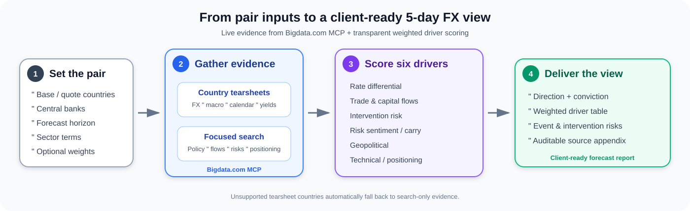

# FX Forecast Report

## Five-Day FX Forecast for Any Currency Pair

A repeatable, parameterized notebook that produces a **five-day-horizon FX forecast
report** for any currency pair — covering a directional view, the key drivers, and the
key risks. It combines **Bigdata.com** data pulls (country tearsheets + news search)
with an **OpenAI** synthesis layer, following the pattern proven in
`Rising_Bond_Spread_Risks` (driver taxonomy + per-category scoring) and
`Daily_Digest_Central_Banks` (central-bank sentiment feed).

> **No Bigdata Python SDK.** This project does **not** use `bigdata-client` or
> `bigdata-research-tools` (both deprecating). All Bigdata.com data comes from the
> **remote MCP server** at `https://mcp.bigdata.com/`, called with the standard `mcp`
> client over streamable HTTP (`x-api-key` header).

## Client-level workflow



At a high level: define the pair once, gather live structured and qualitative evidence
through Bigdata.com MCP, score six explainable FX drivers with configurable weights, and
deliver a five-day directional call with conviction, risks, and auditable sources.

## Features

- Fully parameterized — swap `base_country` / `quote_country` / central-bank names and
  the entire pipeline reruns for any pair (EUR/USD, GBP/JPY, USD/BRL, ...).
- Data layer via `bigdata_country_tearsheet` (FX pricing, economic calendar, sectoral
  macro, market indices, sovereign yields, G7 comparison) + parameterized
  `bigdata_search` for the qualitative layer.
- A six-category **driver taxonomy** (rate differential, trade & capital flows,
  intervention risk, risk sentiment / carry, geopolitical, technical / positioning),
  each scored by an LLM for directional lean, confidence, rationale, and sources.
- Configurable **per-driver weights** with per-pair overrides.
- A markdown report: executive summary, driver table, risk flags (intervention, event
  risk landing inside the horizon, geopolitical tail), and a source appendix.

## Coverage note (important)

`bigdata_country_tearsheet` supports a fixed set of 42 countries (US, JP, UK, EMU, DE,
CN, KR, HK, SG, IN, ...). **Taiwan is not in that set**, and the tearsheet has no
currency-pair argument (so exotic-pair spot such as TWD is not returned structurally).

- **Worked example: `USD/JPY`** — both `US` and `JP` are fully supported, so both
  tearsheets and the rate/carry framing populate, and Japan's MoF/BoJ intervention
  history exercises the intervention-risk driver.
- **`USD/TWD` (the generalization target)** still runs: the US (base) side is
  structured, and the Taiwan (quote) side degrades **gracefully to `bigdata_search`
  only** (central bank, semiconductor exports, intervention chatter, geopolitics).

## Installation and Usage

### Prerequisites
- Python 3.11+
- [uv](https://github.com/astral-sh/uv) package manager

### Setup

```bash
cd FX_Forecast_Report

# Create a virtual environment and install dependencies
uv venv
source .venv/bin/activate        # Windows: .venv\Scripts\activate
uv pip install -r requirements.txt

# Configure credentials
cp .env.example .env             # then edit .env
```

`.env`:

```dotenv
BIGDATA_API_KEY=your_bigdata_api_key
OPENAI_API_KEY=your_openai_api_key
# OPENAI_MODEL=gpt-4o-mini
```

### Run

```bash
uv run jupyter lab
```

Open `FX_Forecast_Report.ipynb` and run the cells top to bottom. To forecast a
different pair, edit the parameters block near the top of the notebook.

## Project structure

```
FX_Forecast_Report/
├── README.md                     # This file
├── requirements.txt              # Dependencies (no bigdata SDK)
├── .env.example                  # Example credentials
├── FX_Forecast_Report.ipynb      # Main notebook
├── assets/
│   └── fx-forecast-workflow.svg  # Client-level workflow diagram
├── config/
│   └── drivers.py                # Driver taxonomy, country coverage, weights
├── src/
│   ├── bigdata_mcp_client.py     # Remote MCP client (tearsheet + search)
│   ├── data_layer.py             # Tearsheet pulls, calendar parsing, query building
│   ├── central_bank_feed.py      # LLM lexicon + parallel central-bank search
│   ├── scoring.py                # Per-driver LLM scoring + weighted aggregation
│   └── report.py                 # Markdown report assembly
├── skills/
│   └── fx-forecast-report/       # Claude/Cursor Agent Skill (MCP-only, no code)
│       └── SKILL.md
└── output/                       # Generated reports + raw data cache
```

## Claude / Cursor Agent Skill

`skills/fx-forecast-report/SKILL.md` packages the same workflow as an **Agent Skill** that
runs **entirely through the Bigdata.com MCP tools** (`bigdata_country_tearsheet` +
`bigdata_search`) — no Python. Point Claude Desktop, Claude Code, or Cursor at the
Bigdata.com MCP server and ask for an FX forecast (e.g. "5-day USD/JPY forecast"); the skill
drives the data pulls, driver scoring, and report format. Use the notebook when you want a
coded, automatable pipeline; use the skill for on-demand conversational forecasts.

## How it works

1. **Parameters** — set base/quote country, pair, horizon, central-bank names, optional
   sector export terms, an intervention-history flag, and (optionally) weight overrides.
2. **Data layer** — pull the base and quote tearsheets (skipping unsupported
   countries), parse the economic calendar for events inside the horizon, and build a
   parameterized set of `bigdata_search` queries.
3. **Central-bank feed** — generate a monetary-policy lexicon per central bank with the
   LLM, search in parallel, and condense the evidence for the rate-differential driver.
4. **Scoring** — the LLM scores each driver (directional lean, confidence, one-line
   rationale, sources) from the tearsheet excerpts + search evidence.
5. **Aggregation** — combine driver scores using the configured weights into an overall
   directional call and conviction for the horizon.
6. **Report** — render an executive summary, driver table, risk flags, and source
   appendix in the notebook and save a markdown copy under `output/`.

## Usage notes

- Run sequentially from top to bottom.
- The report is a research aid, not investment advice.
- New Bigdata.com MCP tools appear automatically over the remote connection — no code
  change required.
