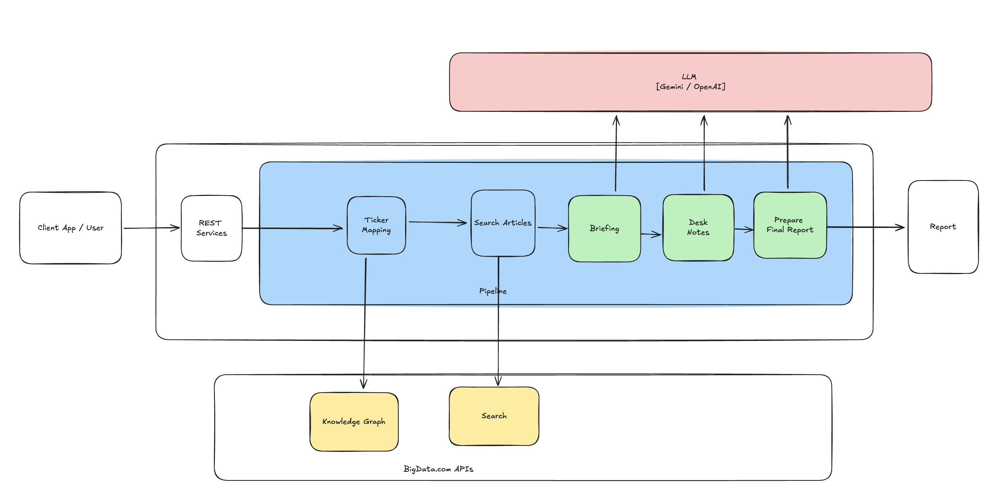

# Index M&A Report Generation

This package provides tools for generating M&A (Mergers & Acquisitions) analysis reports from news data using AI-powered analysis.

## Overview

The Index M&A workflow:
1. **Search News**: Fetch M&A-related news for specified tickers using Bigdata.com API
2. **Generate Briefs**: Create executive briefs summarizing key M&A developments
3. **Generate Desk Notes**: Create Desk Note per ticker
3. **Generate M&A Report**: Produce a structured deal analysis table identifying acquisition targets



## Setup

### 1. Install Dependencies

```bash
pip install -r requirements.txt
```

### 2. Configure Environment Variables

Create a `.env` file in the root directory with your API keys:

```env
# Required: OpenAI API key for report generation
OPENAI_API_KEY=your_openai_api_key_here

# Required: Bigdata.com API key for news search
BIGDATA_API_KEY=your_bigdata_api_key_here

# Optional: LLM configuration
# LLM_PROVIDER=openai  # or 'gemini'
# LLM_MODEL=gpt-4o-mini
```

## Usage

### Quick Start with Jupyter Notebook

Open and run the `index_ma_report.ipynb` notebook for an interactive walkthrough.

```bash
jupyter notebook index_ma_report.ipynb
```

### Workflow Steps

#### Step 1: Search for M&A News

```python
from services.topic_search_service import TopicSearchService
from config.topics import M_AND_A_TOPICS

# Initialize search service
search_service = TopicSearchService()

# Search for M&A news for specific tickers
tickers = ["MSFT", "NFLX", "GOOG"]
days = 90  # Look back period

results = await search_service.search_ticker(
    ticker="MSFT",
    days=days,
    custom_topics=M_AND_A_TOPICS
)
```

#### Step 2: Generate Executive Briefs

```python
from services.report_service import ReportService

report_service = ReportService()

# Generate briefs from search results
briefs = await report_service.generate_topic_briefs(news_response)
```

#### Step 3: Generate M&A Report

```python
import yaml
from pathlib import Path

# Load the M&A report prompt
with open("config/prompts.yaml", 'r') as f:
    prompts = yaml.safe_load(f)

prompt_config = prompts['portfolio_report_ma']

# Format briefs and generate report
ma_report = await llm_service.generate_content_raw(prompt=full_prompt)
```

## Output Format

The M&A report is structured in three sections:

### 1. Deal Table
| Target Company | Acquirer | Deal Value | Status | M&A Announcement Date |
|---------------|----------|------------|--------|----------------------|
| Company A (TICKER) | Acquirer Inc. | $X.XB USD | Pending | Month DD, YYYY |

### 2. Summary
A paragraph highlighting key M&A activity for the period.

### 3. Sources
Each company with hyperlinked sources (top 3 by relevance):

**Company A (TICKER)**
  - [Source Name 1](url)
  - [Source Name 2](url)
  - [Source Name 3](url)

### Output Files

The workflow generates the following output files in the `output/` directory:

| File Pattern | Description |
|-------------|-------------|
| `search_results_{timestamp}.json` | Raw search results from Bigdata.com API |
| `brief_result_{timestamp}.json` | LLM-generated executive briefs with source_map |
| `desk_notes_{timestamp}.json` | Consolidated desk notes per company with sources |
| `ma_report_{timestamp}.md` | Final M&A report in markdown format |

### Source Attribution

Each company in the report includes a **Sources** column with links to the top 3 most relevant sources (by relevance score) from the original search results. The source_map is:
- Extracted from search results after the search phase
- Attached to briefs during brief generation
- Carried through to desk notes
- Added to the final report as clickable hyperlinks

## Project Structure

```
dist/
├── README.md                    # This file
├── requirements.txt             # Python dependencies
├── index_ma_report.ipynb        # Interactive notebook
├── config/
│   ├── __init__.py
│   ├── prompts.yaml             # LLM prompt templates
│   └── topics.py                # M&A topic definitions
├── services/
│   ├── __init__.py
│   ├── llm_service.py           # Base LLM service
│   ├── llm_factory.py           # LLM provider factory
│   ├── openai_service.py        # OpenAI implementation
│   ├── gemini_service.py        # Gemini implementation
│   ├── rate_limiter.py          # API rate limiting
│   ├── report_service.py        # Report generation
│   ├── company_cache.py         # Company data caching
│   └── topic_search_service.py  # News search service
└── output/                      # Generated reports
    ├── search_results_*.json    # Raw search results
    ├── brief_result_*.json      # Executive briefs with sources
    ├── desk_notes_*.json        # Desk notes per company
    └── ma_report_*.md           # Final M&A report
```

## M&A Topics

The package includes pre-defined M&A-focused topics:

- **M&A Activity**: Material acquisitions, mergers, divestitures
- **Strategic Rationale**: Strategic initiatives and business pivots
- **Capital Allocation**: Significant capital allocation decisions
- **Shareholder Actions**: Dividends, buybacks, shareholder returns
- **Debt & Financing**: Debt issuance, refinancing, covenant changes
- **Credit Actions**: Credit rating actions and outlook changes
- **Near-term Events**: Events impacting near-term performance

## Customization

### Custom Topics

You can modify `config/topics.py` to add or customize M&A topics:

```python
M_AND_A_TOPICS = [
    {
        "topic_name": "Your Topic",
        "topic_text": "Your question about {company}?"
    },
    # ... more topics
]
```

### Custom Prompts

Modify `config/prompts.yaml` to customize the report format and style.

## Troubleshooting

### Common Issues

1. **API Key Not Found**: Ensure `.env` file exists with valid API keys
2. **Rate Limiting**: The service includes automatic rate limiting; wait and retry
3. **No Results**: Try expanding the date range or adjusting topics

### Logging

Enable debug logging for troubleshooting:

```python
import logging
logging.basicConfig(level=logging.DEBUG)
```

## Support

For questions or issues, please contact the development team.

