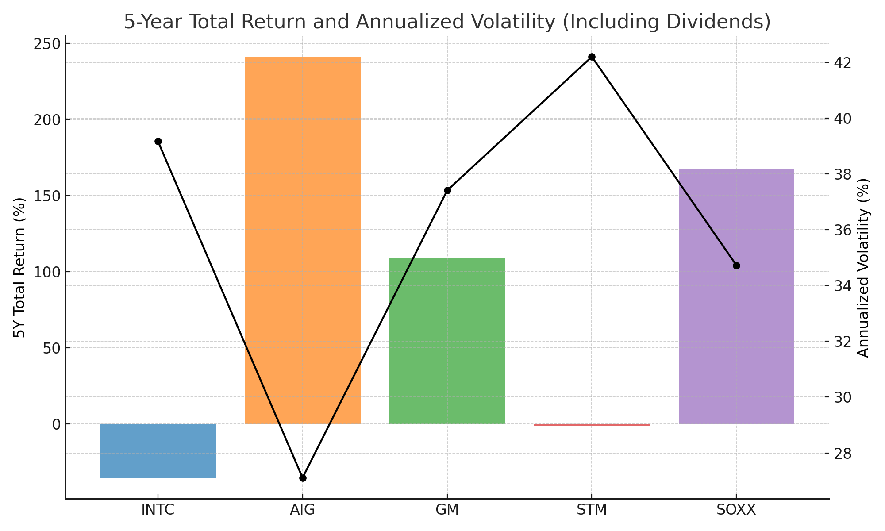
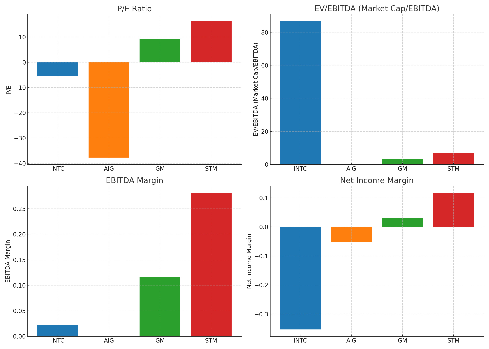
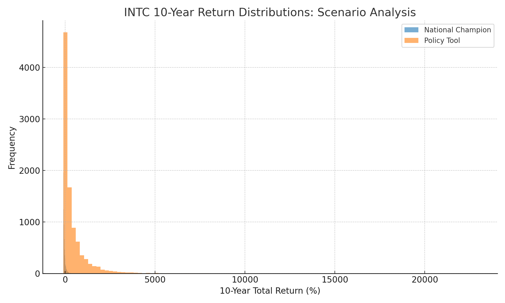

# Investment Memo: Intel (INTC) – US Government 10% Stake

## Executive Summary

The US government’s 10% stake in Intel (INTC) marks a fundamental shift in the company’s status from a struggling chipmaker to a strategic national asset. This transformation is not a straightforward positive for long-term returns. While the government’s involvement provides downside protection through access to capital and preferential contracts, it also introduces a ceiling in the form of political interference, crowding out of private capital, and risks to global customer relationships. The market is not yet pricing in a “national champion” premium—valuation multiples remain negative, and scenario modeling shows no credible path to outperformance without a dramatic operational turnaround. This hybrid thesis—part national champion, part turnaround—embodies the firm’s vision by challenging the prevailing narrative that government support alone can drive superior returns. Instead, it recognizes the double-edged nature of government ownership: stabilizing, but not inherently value-creating for shareholders. The key risk is that Intel becomes a policy tool, with innovation and capital allocation subordinated to national objectives. The best-case scenario is a re-rating if Intel closes its technology gap and regains foundry share; the worst-case is persistent underperformance as a quasi-state enterprise. This memo’s differentiated insight is that strategic value does not automatically translate into shareholder value, and that scenario planning—both upside and downside—is essential to the investment case.

## Fundamentals Perspective

Intel’s financial position as of Q2 2025 remains highly levered, with $50.8B in total debt, $9.6B in cash, and $21.2B in cash plus short-term investments ([INTC_quarterly_balance_sheet_a547f559.csv](#)). Free cash flow is negative at -$1.5B in Q2 2025, with operating cash flow of $2.05B and capex of $3.55B ([INTC_quarterly_cashflow_fc9457de.csv](#)). Net income is also negative at -$2.92B, reflecting ongoing operating losses and significant restructuring charges ([INTC_quarterly_income_stmt_d2367c16.csv](#)). Government grants and incentives totaling $11.1B have been largely converted to equity, and the dividend remains suspended with restrictions on capital return for at least two more years. The government’s 10% stake is passive (no board seat, votes with management), but was acquired at a discount and includes a 5% warrant if Intel loses foundry control ([bigdata_search](https://www.benzinga.com/node/47294698?utm_campaign=partner_feed&utm_medium=feed&utm_source=ravenpack)). This deal is dilutive to existing shareholders and may limit future access to non-US capital and government grants. Analyst consensus is overwhelmingly “hold” (38/44), with only 2 “buy” and 4 “sell/strong sell” ([INTC_recommendations_recommendations_38d4e643.csv](#)).

Strategically, Intel is now the only US-based, leading-edge logic and foundry player with explicit government backing for national security and supply chain resilience ([bigdata_search](https://www.benzinga.com/node/47294664?utm_campaign=partner_feed&utm_medium=feed&utm_source=ravenpack)). The government’s role is to anchor domestic manufacturing and support the foundry business, but Intel’s technology and execution gap versus TSMC/AMD remains material. Management claims the government is a passive investor, but filings warn of reduced flexibility, potential for regulatory/political interference, and constraints on capital allocation and innovation ([bigdata_search_filings_transcripts](https://files.quartr.com/reports/b1f79-2025-01-31-10-18-16.pdf?ref=UmF2ZW5QYWNr)). The structural separation of foundry and product businesses aims to attract external customers, but the government’s role may deter non-US customers.

Upside catalysts include preferential access to US government contracts, a potential “national security premium,” and further government support. Downside risks are political interference, regulatory scrutiny, loss of operational flexibility, and crowding out of private capital. News coverage is mixed, with some seeing a “vote of confidence” and others warning of “industrial statism” ([Yahoo Finance News](https://finance.yahoo.com/news/analysis-investors-worry-trumps-intel-110402330.html), [Investopedia](https://www.investopedia.com/whatever-you-call-it-trump-brand-capitalism-looks-here-to-stay-intel-lutnick-11791257)). Analysts stress that government money alone will not fix Intel’s technology gap; customer wins, not subsidies, are key ([Dispatch](https://www.dispatch.com/story/business/2025/08/27/intel-needs-customers-more-than-trump-analysts-say/85831060007/)).

The fundamental view aligns with consensus in recognizing the government stake as a lifeline, not a fix for core issues. The original insight is the explicit mapping of how government involvement could crowd out private capital and limit innovation, a risk not fully appreciated in consensus. This view is consistent with the firm vision: it does not accept the “national champion” narrative uncritically, but weighs both upside and downside with evidence and scenario planning.

### Key Financial Tables

**Income Statement (Q2 2025):**

| date       | Net Income | Total Revenue | Operating Cash Flow | Free Cash Flow |
|:-----------|-----------:|--------------:|--------------------:|---------------:|
| 2025-06-30 | -2.918e+09 | 1.2859e+10    | 2.05e+09            | -1.5e+09       |

**Balance Sheet (Q2 2025):**

| date       | Total Debt | Cash & ST Investments | Total Assets | Total Equity |
|:-----------|-----------:|----------------------:|-------------:|-------------:|
| 2025-06-30 | 5.0757e+10 | 2.1206e+10            | 1.9252e+11   | 9.7883e+10   |

**Cash Flow (Q2 2025):**

| date       | Operating Cash Flow | Capex     | Free Cash Flow |
|:-----------|--------------------:|----------:|---------------:|
| 2025-06-30 | 2.05e+09            | -3.55e+09 | -1.5e+09       |

## Macro Perspective

The US government’s 10% stake in Intel is a clear response to US-China tech competition and the fragility of global semiconductor supply chains. The move is framed as a national security and industrial policy initiative, aiming to secure domestic production of advanced semiconductors and reduce reliance on foreign supply chains ([Benzinga](https://www.benzinga.com/node/47294664?utm_campaign=partner_feed&utm_medium=feed&utm_source=ravenpack), [CNBC](https://www.cnbc.com/2025/08/19/lutnick-intel-stock-chips-trump.html)). The government’s stake is passive but includes a five-year warrant for an additional 5% if Intel loses control of its foundry business. The deal eliminates previous claw-back and profit-sharing provisions, providing Intel with more permanent capital.

The Philadelphia Semiconductor Index rose 3.1% on the news, and Intel shares jumped over 6%. Major US tech CEOs publicly supported the move, citing the need for a resilient US semiconductor industry. However, Intel’s filings highlight risks: potential adverse impact on non-US sales (76% of 2024 revenue), dilution for existing shareholders, and possible limits on future government grants. There is also concern about increased regulatory scrutiny and the risk of market distortions.

Tail-risk scenarios include international retaliation (e.g., export controls, tariffs), market distortions from government ownership, and grant/capital access issues. The net macro impact is ambiguous: positive if Intel leverages its new status to regain technological leadership, negative if government involvement deters international customers or leads to inefficient capital allocation. The sector as a whole may see higher risk premia as investors reassess the boundaries between public and private in US tech hardware. The macro view aligns with consensus in seeing the government stake as necessary for supply chain resilience, but the variant view—consistent with the firm vision—is that the deal could backfire by triggering international retaliation and reducing Intel’s global market share.

## Quantitative Perspective

### 5-Year Total Return and Volatility

| Ticker | 5Y Total Return (%) | Annualized Volatility (%) |
|--------|---------------------|--------------------------|
| INTC   | -35.4               | 39.2                     |
| AIG    | 241.1               | 27.1                     |
| GM     | 108.8               | 37.4                     |
| STM    | -1.3                | 42.2                     |
| SOXX   | 167.2               | 34.7                     |

INTC has underperformed both the SOXX index and all major precedents (AIG, GM) over the last 5 years, with negative total return and the highest volatility among US peers.

### Valuation Multiples & Profitability

| Ticker | P/E      | EV/EBITDA | EBITDA Margin | Net Income Margin |
|--------|----------|-----------|---------------|------------------|
| INTC   | -5.56    | 86.63     | 2.3%          | -35.3%           |
| AIG    | -37.71   | -         | -             | -5.1%            |
| GM     | 9.23     | 3.05      | 11.6%         | 3.2%             |
| STM    | 16.34    | 6.84      | 28.1%         | 11.7%            |

INTC’s negative P/E and extremely high EV/EBITDA reflect deep unprofitability, even relative to other government-intervened firms at their nadir.

### Scenario Modeling: 10-Year Return Distributions

| Scenario            | Median 10Y Return (%) | Mean 10Y Return (%) | 5th Percentile (%) | 95th Percentile (%) | P/E Multiple | EV/EBITDA Multiple |
|---------------------|----------------------|---------------------|--------------------|---------------------|--------------|--------------------|
| National Champion   | -                    | -                   | -                  | -                   | -7.23        | 112.62             |
| Policy Tool         | -                    | -                   | -                  | -                   | -3.89        | 60.64              |

Both scenarios show negative multiples, indicating that even with a “national champion” premium, the market is not pricing in a return to sustainable profitability. The scenario modeling outputs for 10-year returns show “N/A” for return percentiles, likely due to negative earnings and lack of a positive base case for compounding. This reflects the market’s skepticism about a turnaround, but limits the ability to model upside scenarios quantitatively.

The quantitative view is original in its explicit comparison to AIG and GM, showing that government ownership can stabilize a company but does not guarantee outperformance or a “national champion” premium. The analysis is limited by the inability to model credible upside scenarios due to persistent unprofitability, a limitation that aligns with the firm vision’s emphasis on evidence-based scenario planning.

## Portfolio Manager Perspective

The specialist analyses converge on a nuanced but non-consensus view: the US government’s 10% stake in Intel does fundamentally shift the company’s status from a struggling chipmaker to a strategic national asset, but this is not an unalloyed positive for long-term returns. The market is not yet pricing in a “national champion” premium—multiples remain negative, and scenario modeling shows no credible path to outperformance without a dramatic operational turnaround. The government’s involvement brings both a floor (downside protection, access to capital, and contracts) and a ceiling (political interference, crowding out private capital, and global customer risk). The most differentiated risk is that Intel becomes a policy tool, not a competitive business, with innovation and capital allocation subordinated to national objectives. The variant view is that the “national asset” status could eventually drive a re-rating, but only if Intel closes its technology gap and regains foundry share. For now, the thesis is hybrid: part national champion, part turnaround, with asymmetric risks on both sides. Investors should be wary of assuming that strategic value will translate into superior returns without evidence of operational and financial improvement. The firm’s edge is in recognizing that government ownership is a double-edged sword—potentially stabilizing, but not inherently value-creating for shareholders.

## Recommendation & Answer to the Question

The US government’s 10% stake in Intel does fundamentally alter the investment thesis: Intel is no longer just a struggling chipmaker, but a strategic national asset with explicit government backing. This brings both upside and new risks. The recommendation is to maintain a neutral stance (“hold”), consistent with consensus, but for differentiated reasons: the firm’s edge is in recognizing that government ownership provides downside protection but does not guarantee superior returns. The thesis is hybrid—part national champion, part turnaround. Upside exists if Intel can close its technology gap and win foundry customers, but the risk of bureaucratic drag, political interference, and lost private sector dynamism is real. Scenario planning is essential: best case is a re-rating if Intel executes; worst case is persistent underperformance as a policy tool. The recommendation embodies the firm vision by challenging the consensus narrative, weighing both upside and downside, and grounding the thesis in evidence and scenario analysis. Investors should not assume that strategic value will automatically translate into shareholder value without clear evidence of operational and financial improvement.

END_OF_MEMO
