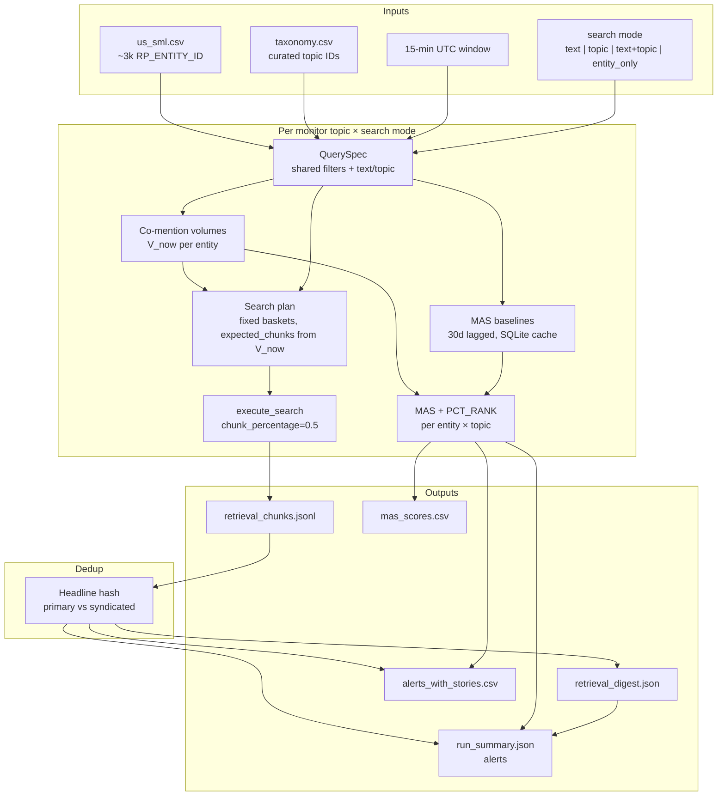

# Client News Monitor

Retrieval-only news monitor for ~3,000 US small/mid companies over a configurable Bigdata timestamp window. Scores abnormal news volume (MAS) across four fixed monitor topics — no LLM labeling, no MCP.

Uses [Bigdata.com](https://bigdata.com) smart search and [bigdata-smart-batching](https://docs.bigdata.com/use-cases/search-service/smart-batching).

## Architecture



Each run loops over **4 monitor topics** (`earnings`, `contracts`, `leadership`, `regulatory`) unless `--search-mode entity_only` is set (one entity-wide pass, no taxonomy filter). With `--compare-modes`, the full pipeline runs three times (one per taxonomy search mode).

## Setup

```bash
uv sync
cp .env.example .env   # set BIGDATA_API_KEY
```

Only `BIGDATA_API_KEY` is required. Run commands from this directory so `.env` is loaded automatically.

## Quick start

```bash
# Smoke test (50 companies, 15-min window ending now UTC)
uv run client-news-monitor --limit-entities 50

# Full PoC (~3k names from us_sml.csv)
uv run client-news-monitor \
  --universe us_sml.csv \
  --taxonomy taxonomy.csv \
  --search-mode text+topic \
  --chunk-percentage 0.5 \
  --output-dir runs/client_poc

# Broader news category (more recall, more noise)
uv run client-news-monitor --category-profile news --limit-entities 50

# Compare text / topic / text+topic (~3× retrieval cost)
uv run client-news-monitor ... --compare-modes
```

## What it does

For each of **4 monitor topics** (`earnings`, `contracts`, `leadership`, `regulatory`):

1. **Co-mention volume** — per-entity chunk counts (`V_now`) in the window
2. **Retrieval** — smart-batched search at `--chunk-percentage 0.5`; skips zero-volume baskets
3. **MAS scoring** — Media Attention Score vs a cached 30-day baseline (same query spec)
4. **Syndication dedup** — headline-hash collapse within the run

**Document category:** controlled by `--category-profile` (default `news_premium`). Use `news` for broader wire coverage at the cost of more noise; `news_premium` excludes SEC filings and transcripts.

## MAS scoring

**Media Attention Score (MAS)** flags entities whose news volume in the current window is unusually high relative to their own recent history. It uses the **same `QuerySpec`** as retrieval (monitor topic, search mode, category, text/topic filters) so volume, baselines, and search stay aligned.

### Step 1 — Current volume (`V_now`)

For each entity, call Bigdata **co-mention volume** over the run window. `V_now` is the chunk count returned for that entity under the active query spec.

### Step 2 — Baseline (`λ`, stored as `LAMBDA_BUCKET`)

On first run (or with `--force-baseline-refresh`), fetch co-mention volumes over a **lagged 30-day window** ending **1 day before** the current window end. Results are cached in `mas_baselines.db`, keyed by `(query_hash, entity_id)`.

The baseline is scaled to the current bucket length:

```
λ = (volume_30d / minutes_in_30d) × window_minutes
```

For a 15-minute run, `λ` is the expected chunk count in 15 minutes given the prior 30 days.

### Step 3 — Score (0–100)

For each entity with `V_now > 0`:

| Metric | Formula | Meaning |
|--------|---------|---------|
| **MAR** | `(V_now + 1) / (λ + 1)` | Raw volume ratio vs baseline |
| **Z** | `(V_now − λ) / √(λ + 1)` | Poisson-style surprise |
| **MAS** | `min(100, 100 × sigmoid(Z / 5) × log1p(V_now) / log1p(λ + 10))` | Combined surprise × magnitude |

If `V_now = 0`, **MAS = 0**.

Implementation: `src/client_monitor/mas.py`.

### Step 4 — Rank and alert

Within each monitor topic, entities are assigned **PCT_RANK** (0–100, ascending by `V_now` then `Z`).

An **alert** fires when either:

1. **High MAS** — entity is in the **top ~1%** `PCT_RANK` for that topic *and* `MAS > 0`, or
2. **Primary chunk** — entity has at least one **primary** retrieved story in that topic (after syndication dedup).

`alerts_with_stories.csv` keeps only alerts that also have a primary chunk (inner join). MAS-only alerts appear in `run_summary.json` and `mas_scores.csv` but not in the story feed.

## Monitor topics

Curated topic filters from `taxonomy.csv` (`TOPIC=business`). Rules in `src/client_monitor/topics.py`.

| Topic | Document-voice text | Taxonomy rule | ~topic IDs |
|-------|---------------------|---------------|------------|
| `earnings` | Earnings, financial results, analyst ratings | GROUPs: `earnings`, `revenues`, `dividends`, `analyst-ratings` | ~211 |
| `contracts` | Contracts, partnerships, strategic developments | All `partnerships` + `products-services` types: `business-contract`, `government-contract`, `award` | ~19 |
| `leadership` | Executive/leadership changes | `labor-issues` types: `executive-*`, `board-member-*`, `board-diversity` | ~37 |
| `regulatory` | Regulatory/legal/government news | All `regulatory` GROUP | ~22 |

## CLI reference

| Option | Default | Description |
|--------|---------|-------------|
| `--universe` | `us_sml.csv` | CSV with `RP_ENTITY_ID`, `COMPANY_NAME` |
| `--taxonomy` | `taxonomy.csv` | Bigdata taxonomy CSV |
| `--output-dir` | `runs/client_poc_<timestamp>` | Run output directory |
| `--window-end` | now (UTC) | Window end ISO timestamp |
| `--window-minutes` | `15` | Window length in minutes |
| `--search-mode` | `text+topic` | `text`, `topic`, `text+topic`, or `entity_only` |
| `--category-profile` | `news_premium` | `news_premium` or `news` |
| `--compare-modes` | off | Run all three search modes |
| `--chunk-percentage` | `0.5` | Proportional chunk sampling per basket |
| `--limit-entities` | `0` (all) | Limit to first N companies |
| `--max-chunks-per-basket` | none | Hard cap on `max_chunks` |
| `--seen-headlines-db` | none | Optional SQLite for cross-run headline dedup |
| `--force-baseline-refresh` | off | Re-fetch 30-day MAS baselines |
| `--requests-per-minute` | `350` | Bigdata search rate limit |

### Search modes

| Mode | `query.text` | `filters.topic` | Entity `search_in` |
|------|--------------|-----------------|-------------------|
| `text` | document-voice string | omitted | `BODY` |
| `topic` | omitted | curated taxonomy IDs | `BODY` |
| `text+topic` | document-voice string | curated taxonomy IDs | `BODY` |
| `entity_only` | omitted | omitted | `ALL` |

`entity_only` runs **once per search mode** with `monitor_topic=entity_wide` — all news about the entity in the window, not scoped to the four monitor topics. See [Targeted backfill](#targeted-backfill-recommended-not-automated) below.

### Targeted backfill (recommended, not automated)

**Targeted backfill** is a second retrieval pass for a **small set of names that already look interesting**, not entity-wide search on the full ~3k universe every 15 minutes.

**Primary pass (production default):** topic-scoped retrieval + MAS on the full universe. Alerts fire when a company is in the top 1% MAS for a topic or has a primary retrieved chunk. Many alerts are **MAS-only** — volume spiked, but no story passed the topic filter — and those are omitted from `alerts_with_stories.csv`.

**Backfill pass (proposed):** for entities with a MAS alert and **no** primary chunk in that topic, run `entity_only` search for **that entity only** in the same window. This can recover stories outside the four taxonomy lanes (e.g. a partnership wire tagged outside `contracts`) without paying the cost of brute entity search on every name.

| | Full-universe `entity_only` every 15 min | Targeted backfill |
|---|------------------------------------------|-------------------|
| Scope | All ~3k entities | MAS-fired entities with no story (typically tens, not thousands) |
| Query | `entity_only` | Same |
| Cost | Prohibitive at scale | Bounded by alert count |

**Status:** `entity_only` is implemented as a CLI search mode. The **automatic** MAS-triggered second pass is **not** wired into `pipeline.py` yet.

**Manual approximation today:**

1. Run the primary pass with default `--search-mode text+topic` (or `topic`).
2. From `run_summary.json` or `mas_scores.csv`, identify `(entity_id, monitor_topic)` pairs that alerted but have no row in `alerts_with_stories.csv`.
3. Run `entity_only` on a trimmed universe containing only those entities (custom CSV or `--limit-entities` on a filtered list).

## Output artifacts

```
{output_dir}/
  config.json
  plans/<topic>_<mode>.json
  mas_scores.csv
  mas_baselines.db
  retrieval_chunks.jsonl
  retrieval_digest.json
  alerts_with_stories.csv
  run_summary.json
```

Alerts in `run_summary.json` fire when a company is in the **top 1% MAS** for a topic or has a **primary retrieved chunk** in that topic.

`alerts_with_stories.csv` is the **inner join** of those alerts with primary chunks: MAS-only alerts are omitted. One row per `(entity_id, monitor_topic, document_id)` story, sorted by MAS then relevance.

## Tests

```bash
uv run python -m pytest tests/test_client_monitor.py -v
uv run ruff check src/client_monitor tests
```

## Cost notes

- **Volume pass:** ~60–80 co-mention calls per monitor topic for ~3k entities
- **Baselines:** cached in `mas_baselines.db` after first run per `(topic, search_mode)`
- **Retrieval:** only baskets with `V_now > 0`; default 50% chunk sampling
- **Pricing:** $0.015 per 10 chunks retrieved

## Project layout

```
src/client_monitor/   # pipeline modules
taxonomy.csv          # Bigdata topic taxonomy (business rows)
us_sml.csv            # default universe (~3k US small/mid names)
runs/                 # run outputs (gitignored recommended)
```
