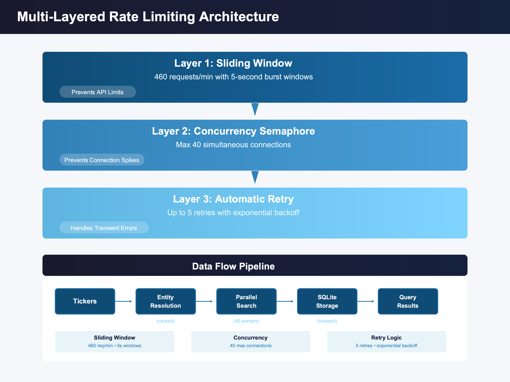

# Large Scale Search

A Notebook demonstrating high-performance portfolio search tool built on the Bigdata.com API that enables searching financial news across hundreds of tickers with intelligent rate limiting and parallel processing.

## Features

- **Entity Resolution**: Automatic ticker-to-entity ID mapping via Knowledge Graph API with CSV caching
- **Parallel Processing**: ThreadPoolExecutor for high-throughput searches across large portfolios
- **Multi-Layered Rate Limiting**: Token bucket algorithm with sliding windows to prevent API throttling
- **SQLite Storage**: Persistent storage for search results with indexing for fast queries
- **Customizable Topics**: Define research questions with company name placeholders
- **Query Interface**: Filter results by ticker, topic, or custom criteria

---

## Quick Start

### Prerequisites

- Python 3.8 or higher
- [uv](https://github.com/astral-sh/uv) package manager
- Bigdata API access

### Installation

1. **Install uv** (if not already installed):
   ```bash
   curl -LsSf https://astral.sh/uv/install.sh | sh
   ```

2. **Navigate to the project directory**:
   ```bash
   cd Search_Large_Scale
   ```

3. **Create a virtual environment and install dependencies**:
   ```bash
   uv venv
   source .venv/bin/activate  # On Windows: .venv\Scripts\activate
   uv pip install -r requirements.txt
   uv pip install jupyterlab
   ```

4. **Set Your API Key**:

   Create a `.env` file in the project directory:
   ```
   BIGDATA_API_KEY=your-api-key-here
   ```

   Or export it as an environment variable:
   ```bash
   export BIGDATA_API_KEY="your-api-key-here"
   ```

5. **Start JupyterLab**:
   ```bash
   jupyter lab
   ```

### Configure Your Search

Edit the configuration section in the notebook:

```python
# Tickers to search
TICKERS_INPUT = "AAPL, MSFT, GOOGL, TSLA, NVDA"

# Date range
START_DATE = "2025-01-01"
END_DATE = "2025-01-12"

# Topics with {company} placeholder
TOPICS = [
    {"topic_name": "Financial Metrics", "topic_text": "What key takeaways emerged from {company}'s latest earnings report?"},
    {"topic_name": "M&A", "topic_text": "What significant acquisition activities involve {company}?"},
    # Add more topics...
]
```

### Run the Notebook

1. **Open the notebook**:
   - When JupyterLab starts, click on one of the provided URLs in the terminal
   - Open `large_search.ipynb` in JupyterLab

2. **Execute all cells** in `large_search.ipynb` to:
   - Resolve tickers to entity IDs (cached for future runs)
   - Execute parallel searches across all ticker+topic combinations
   - Store results in SQLite database
   - Query and analyze results

---

## Architecture



---

## Configuration Reference

### User Inputs

| Parameter | Type | Description |
|-----------|------|-------------|
| `TICKERS_INPUT` | `str` | Comma-separated ticker symbols |
| `START_DATE` | `str` | Search start date (YYYY-MM-DD) |
| `END_DATE` | `str` | Search end date (YYYY-MM-DD) |
| `TOPICS` | `list[dict]` | Topic definitions with `topic_name` and `topic_text` |

### Advanced Settings

| Parameter | Default | Description |
|-----------|---------|-------------|
| `MAX_REQUESTS_PER_MINUTE` | 460 | API rate limit (8% safety margin) |
| `MAX_CHUNKS_PER_QUERY` | 10 | Maximum results per search query |
| `DOCUMENT_TYPES` | `["NEWS", "TRANSCRIPT"]` | Document types to include |
| `SENTIMENT_VALUES` | `["positive", "negative"]` | Sentiment filter |
| `SEARCH_WORKERS` | 10 | Parallel search workers |
| `ENTITY_WORKERS` | 10 | Parallel entity resolution workers |

---

## Topic Configuration

Topics use `{company}` placeholder for automatic substitution:

```python
TOPICS = [
    # Earnings & Financial Performance
    {"topic_name": "Financial Metrics", "topic_text": "What key takeaways emerged from {company}'s latest earnings report?"},
    
    # Strategy & Business Development
    {"topic_name": "M&A", "topic_text": "What material acquisition activities involve {company}?"},
    
    # Leadership Changes
    {"topic_name": "Leadership", "topic_text": "What executive leadership changes have been announced at {company}?"},
    
    # Competitive Landscape
    {"topic_name": "Competition", "topic_text": "What significant contract wins or losses has {company} announced?"},
    
    # Add custom topics as needed...
]
```

### Predefined Topic Categories

| Category | Description |
|----------|-------------|
| Financial Metrics | Earnings, guidance, financial performance |
| M&A | Mergers, acquisitions, divestitures |
| Leadership | Executive changes, board updates |
| Competition | Contract wins/losses, market share |
| Products | Product launches, R&D pipeline |
| Supply Chain | Operations, disruptions, efficiency |
| Costs | Cost-cutting, expense management |
| Regulatory | Regulatory developments, litigation |
| Industry | Macro trends, sector-specific issues |
| Financing | Capital allocation, dividends, debt |
| Markets | Sentiment, events, activist investors |

---

## Output Files

| File | Description |
|------|-------------|
| `output/entity_cache.csv` | Cached ticker → entity ID mappings |
| `output/search_results.db` | SQLite database with all search results |

### Database Schema

**search_results table:**

| Column | Type | Description |
|--------|------|-------------|
| `ticker` | TEXT | Stock ticker symbol |
| `company_name` | TEXT | Company name |
| `entity_id` | TEXT | Bigdata.com entity ID |
| `topic_name` | TEXT | Topic category |
| `topic_text` | TEXT | Full search query |
| `headline` | TEXT | Article headline |
| `timestamp` | TEXT | Publication timestamp |
| `source_name` | TEXT | Source name |
| `chunk_text` | TEXT | Relevant text excerpt |
| `chunk_relevance` | REAL | Relevance score |
| `chunk_sentiment` | REAL | Sentiment score |
| `document_url` | TEXT | Article URL |

---

## Querying Results

### By Ticker

```python
ticker_results = query_by_ticker(db_conn, "AAPL", limit=20)
for result in ticker_results:
    print(f"{result['topic_name']}: {result['headline']}")
```

### By Topic

```python
topic_results = query_by_topic(db_conn, "Leadership", limit=30)
for result in topic_results:
    print(f"{result['ticker']}: {result['headline']}")
```

### Database Statistics

```python
stats = get_database_stats(db_conn)
print(f"Total results: {stats['total_results']}")
print(f"Results by ticker: {stats['by_ticker']}")
print(f"Results by topic: {stats['by_topic']}")
```

---

## Performance Characteristics

For a portfolio of ~100 tickers with 26 topics:

| Metric | Typical Value |
|--------|---------------|
| Total queries | ~2,500 |
| Wall-clock time | ~5-7 minutes |
| Results stored | ~5,000-10,000 |
| API requests/sec | ~7-8 |

The parallel architecture ensures efficient use of the API rate limits while preventing throttling.

---

## Requirements

- Python 3.8 or higher
- [uv](https://github.com/astral-sh/uv) package manager
- `BIGDATA_API_KEY` environment variable

### Dependencies

All dependencies are listed in `requirements.txt`:
- `requests>=2.31.0` - HTTP library for API requests
- `python-dotenv>=1.0.0` - Environment variable management
- `httpx>=0.24.0` - Async HTTP client library

### Installation

See the [Quick Start](#quick-start) section above for installation instructions using `uv`.

---

## Files

| File | Description |
|------|-------------|
| `large_search.ipynb` | Main notebook with complete workflow |
| `requirements.txt` | Python dependencies |
| `README.md` | This documentation |
| `static/` | Architecture diagrams |
| `output/` | Generated output files (gitignored) |

---

## Tips

1. **Entity Caching**: Entity resolutions are cached to `entity_cache.csv`. Delete this file to force re-resolution.

2. **Custom Queries**: Use SQL queries directly on the SQLite database for advanced analysis.

3. **Rate Limit Monitoring**: Watch the protection stats at the end of execution for insights.

4. **Large Portfolios**: The system handles large tickers efficiently with parallel processing.

---

## API Documentation

- [Bigdata.com API Docs](https://docs.bigdata.com)
- [Knowledge Graph API](https://docs.bigdata.com/getting-started/knowledge_graph)
- [Search API](https://docs.bigdata.com/getting-started/search)

---

## Support

For API issues or questions, contact your Bigdata.com representative.

