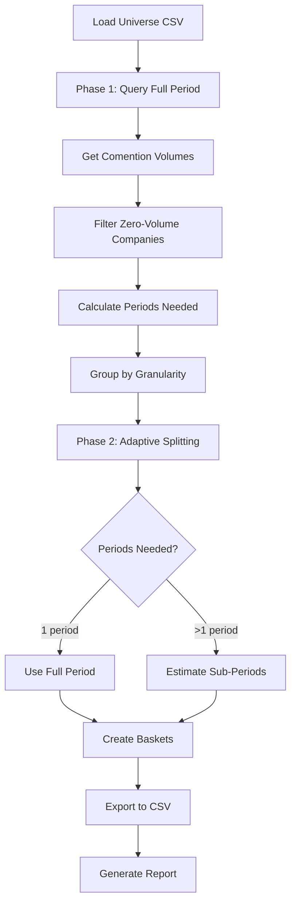

# Smart Batching for Semantic Search

A production-ready tool for optimizing semantic search queries across large company universes by intelligently batching companies based on comention volume and automatically determining optimal time granularity.

## Overview

Smart Batching solves the challenge of efficiently retrieving all relevant topic-related chunks for hundreds or thousands of companies over extended time periods. Instead of making thousands of individual queries, the system:

1. **Analyzes volume**: Uses the comention endpoint to determine chunk volumes per company
2. **Optimizes batching**: Groups companies into baskets that maximize query efficiency
3. **Adapts granularity**: Automatically determines optimal time period granularity (yearly, quarterly, monthly, weekly) for each company based on its volume
4. **Minimizes queries**: Reduces the total number of semantic search queries by 100-1000x compared to naive approaches

## Methodology

### Two-Phase Approach

**Phase 1: Volume Discovery**
- Query the full time period once for all companies using the comention endpoint
- Retrieve total chunk volumes for each company
- Filter out companies with zero chunks (no search needed)

**Phase 2: Adaptive Batching**
- Calculate optimal time granularity for each company: `periods_needed = ceil(total_chunks / 1000)`
- Group companies by granularity requirements
- For companies needing multiple periods, estimate sub-period volumes using uniform distribution
- Create baskets of companies that maximize chunk utilization while staying under the 1000-chunk limit per query

### Key Optimizations

- **Single Full-Period Query**: Instead of querying each sub-period separately, query the full period once and estimate sub-periods
- **Adaptive Granularity**: Companies with <1000 chunks use the full period; high-volume companies automatically split into finer granularities (yearly → quarterly → monthly → weekly)
- **Volume-Based Grouping**: Companies are grouped by volume ranges (high, medium, low) for efficient basket creation
- **Full Coverage**: Always covers the complete time period, ensuring no data is missed

## Features

- **Intelligent Batching**: Automatically groups companies to maximize query efficiency
- **Adaptive Time Splitting**: Determines optimal granularity per company (biyearly, yearly, quarterly, monthly, weekly)
- **Volume Estimation**: Uses uniform distribution to estimate sub-period volumes for high-volume companies
- **CSV Export**: Generates two CSV files:
  - `entities_baskets.csv`: Entity-level mapping with chunks and basket assignments
  - `baskets_details.csv`: Basket-level details with time ranges and company lists
- **Efficiency Metrics**: Reports total queries, utilization, and optimization statistics

## Quick Start

### 1. Installation

```bash
pip install -r requirements.txt
```

### 2. Set Your API Key

```bash
export BIGDATA_API_KEY="your-api-key-here"
```

### 3. Prepare Your Universe File

The default universe file is `us_top3000.csv` (included as an example). Replace it with your own CSV file containing one company ID per line:

```csv
228D42
D8442A
...
```

### 4. Run Smart Batching

```bash
# Basic usage with default topic
python run_smart_batching.py

# Custom topic
python run_smart_batching.py --topic "AI adoption in healthcare"

# Custom universe file
python run_smart_batching.py --topic "earnings outperforming expectations" --universe my_companies.csv

# Save JSON report
python run_smart_batching.py --topic "earnings" --output report.json
```

## Configuration

### Command-Line Arguments

| Argument | Default | Description |
|----------|---------|-------------|
| `--topic` | `"earnings outperforming expectations"` | Topic string for comention and semantic search queries |
| `--output` | `None` | Path to save JSON report (optional) |
| `--entities-csv` | `output/entities_baskets.csv` | Path for entities CSV file |
| `--baskets-csv` | `output/baskets_details.csv` | Path for baskets CSV file |
| `--universe` | `us_top3000.csv` | Path to universe CSV file |
| `--api-key` | `BIGDATA_API_KEY` env var | BigData API key |

### Configuration File (`smart_batching_config.py`)

| Parameter | Default | Description |
|-----------|---------|-------------|
| `API_BASE_URL` | `"https://api.bigdata.com"` | BigData API base URL |
| `MAX_ENTITIES_IN_ANY_OF` | `500` | Max entities per comention query (API complexity limit) |
| `MAX_CHUNKS_PER_BASKET` | `1000` | Maximum chunks per basket (query limit) |
| `START_DATE` | `"2021-01-01"` | Default start date |
| `END_DATE` | `"2022-12-31"` | Default end date |
| `UNIVERSE_CSV_PATH` | `"us_top3000.csv"` | Default universe file path |

## Output Files

### `entities_baskets.csv`

Entity-level mapping showing which basket each company belongs to and its chunk volumes:

| Column | Description |
|--------|-------------|
| `entity_id` | Company entity ID |
| `chunks` | Chunks for this company in this specific basket |
| `total_chunks` | Total chunks for this company across all baskets |
| `basket_id` | Basket identifier |
| `period_start` | Start date of the period for this basket |
| `period_end` | End date of the period for this basket |

**Note**: Companies are sorted by `total_chunks` descending (largest to smallest).

### `baskets_details.csv`

Basket-level details for executing semantic search queries:

| Column | Description |
|--------|-------------|
| `basket_id` | Unique basket identifier |
| `start_date` | Start date for this basket's time period |
| `end_date` | End date for this basket's time period |
| `entities` | Comma-separated list of company entity IDs in this basket |
| `total_chunks` | Total chunks in this basket (sum of all companies) |
| `company_count` | Number of companies in this basket |

## Architecture



## Examples

### Example 1: Basic Usage

```bash
python run_smart_batching.py --topic "earnings outperforming expectations"
```

This will:
1. Load `us_top3000.csv` (or your custom universe)
2. Query comention endpoint for all companies
3. Generate optimized baskets
4. Export CSVs to `output/` directory
5. Print efficiency metrics

### Example 2: Custom Topic and Universe

```bash
python run_smart_batching.py \
  --topic "AI adoption in healthcare" \
  --universe healthcare_companies.csv \
  --output healthcare_plan.json
```

### Example 3: Custom Output Paths

```bash
python run_smart_batching.py \
  --topic "earnings" \
  --entities-csv custom_entities.csv \
  --baskets-csv custom_baskets.csv
```

## Efficiency Metrics

The system reports several efficiency metrics:

- **Total Comention Queries**: Number of comention API calls (typically ~10 for 5000 companies)
- **Semantic Search Queries**: Total number of semantic search queries needed (optimized)
- **Avg Chunks per Query**: Average chunk utilization per query
- **Utilization**: Percentage of the 1000-chunk limit used on average

### Typical Performance

For a universe of ~5,000 companies over 2 years:

| Metric | Typical Value |
|--------|---------------|
| Comention Queries | ~10 |
| Semantic Search Queries | ~100-500 (vs. 100,000+ naive) |
| Reduction Factor | 100-1000x |
| Wall-clock time (planning) | ~1-2 minutes |

## How It Works

### Step 1: Volume Discovery

The system queries the comention endpoint once for the full time period, retrieving chunk volumes for all companies. Companies are batched in groups of 500 (API complexity limit) to avoid query complexity errors.

### Step 2: Granularity Determination

For each company, the system calculates:
```
periods_needed = ceil(total_chunks / 1000)
```

Companies are then grouped by `periods_needed` and assigned the coarsest granularity that provides enough periods:
- 1 period → biyearly (full period)
- 2 periods → yearly (2 years)
- 3-8 periods → quarterly (8 quarters)
- 9-24 periods → monthly (24 months)
- 25+ periods → weekly (104 weeks)

### Step 3: Volume Estimation

For companies needing multiple periods, sub-period volumes are estimated using uniform distribution:
```
estimated_chunks = (total_chunks * sub_period_days) / total_period_days
```

### Step 4: Basket Creation

Companies are grouped into baskets by volume range (high, medium, low) and time period. Each basket:
- Contains companies with similar volume characteristics
- Stays under the 1000-chunk limit
- Maximizes chunk utilization

## Requirements

- Python 3.8+
- `requests>=2.31.0`
- `BIGDATA_API_KEY` environment variable or `--api-key` argument

## Files

| File | Description |
|------|-------------|
| `smart_batching.py` | Main SmartBatchingPlanner class |
| `smart_batching_config.py` | Configuration constants |
| `run_smart_batching.py` | Command-line execution script |
| `us_top3000.csv` | Example universe file (US top 3000 companies) |
| `requirements.txt` | Python dependencies |
| `output/` | Output directory for CSV files |
| `README.md` | This documentation |

## Tips

1. **Universe File Format**: Your universe CSV should contain one company entity ID per line, no header row.

2. **API Complexity**: The system automatically handles API complexity limits by batching companies in groups of 500 for comention queries.

3. **Volume Estimation**: For high-volume companies, the system uses uniform distribution. Actual volumes may vary, but this ensures full coverage.

4. **Custom Time Periods**: Modify `START_DATE` and `END_DATE` in `smart_batching_config.py` or pass them programmatically.

5. **Output Directory**: The `output/` directory is created automatically if it doesn't exist.

## API Documentation

- [Bigdata.com API Docs](https://docs.bigdata.com)
- [Comention Endpoint](https://docs.bigdata.com/api-reference/co-mentions)
- [Semantic Search API](https://docs.bigdata.com/api-reference/search)

## Support

For API issues or questions, contact your Bigdata.com representative.
