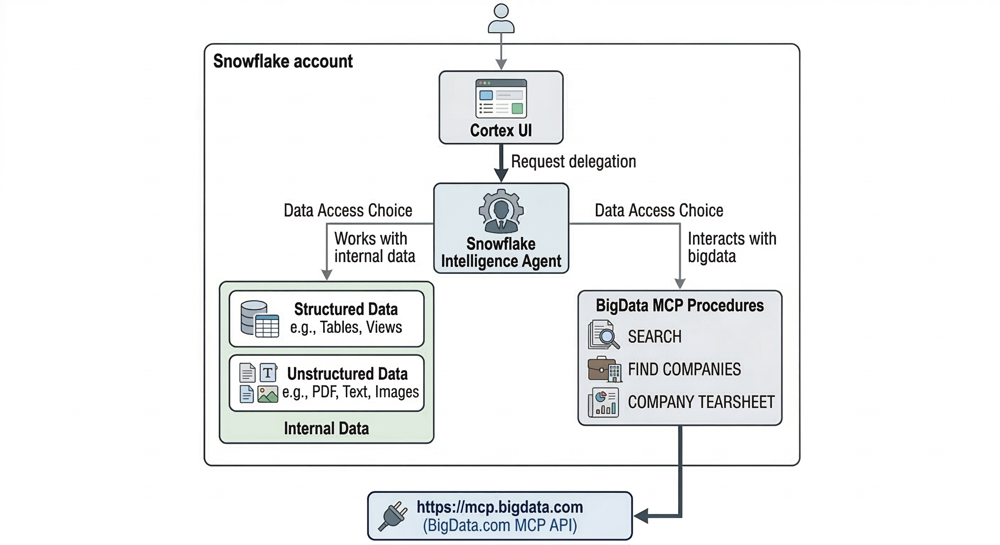
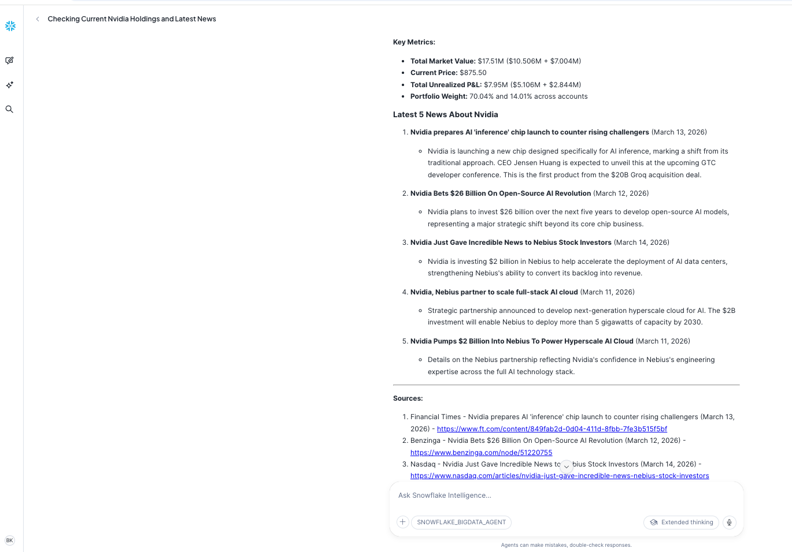

# Snowflake + BigData MCP Demo — End-to-End Guide

Demonstrate [BigData.com](https://bigdata.com) financial intelligence alongside **live Snowflake data** inside **Snowflake Intelligence** — all powered by the BigData MCP protocol and a single Cortex Agent (`SNOWFLAKE_BIGDATA_AGENT`).

The demo shows how Snowflake customers can combine their own internal data with real-time external financial intelligence (news, filings, earnings, company profiles) in one natural-language chat experience.

## What the Demo Covers

| Capability | Powered by | Example question |
|---|---|---|
| Query portfolio data (structured) | `INTERNAL_PORTFOLIO_ANALYST` (Cortex Analyst) | *"What are the top holdings by market value?"* |
| Search internal research docs (unstructured) | `INTERNAL_RESEARCH_SERVICE` (Cortex Search) | *"What is our investment thesis on NVIDIA?"* |
| Generate charts from query results | `DATA_TO_CHART` | *"Show that as a bar chart"* |
| Search financial news & filings | `BIGDATA_SEARCH` (BigData MCP) | *"Latest Apple earnings news"* |
| Resolve company/ETF/fund by name or ticker | `BIGDATA_FIND_SECURITIES` (BigData MCP) | *"Find the entity ID for Tesla"* |
| Full company financial profile | `BIGDATA_COMPANY_TEARSHEET` (BigData MCP) | *"Financial tearsheet for Microsoft"* |

## Architecture



---

## Part 1: Snowflake Account and Basic Setup

Everything you need before running any scripts.

### 1.1 — Snowflake Account Requirements

> **IMPORTANT: A paid Snowflake Enterprise (or higher) account is required.**
> Trial accounts do NOT support External Access Integrations, which are needed
> to call the BigData MCP API. If you only have a trial account, you must add
> billing information (Admin → Billing in Snowsight) to convert it to a paid
> account before proceeding. 

### 1.2 — Create a Warehouse

Open a new SQL Worksheet and run:

```sql
CREATE WAREHOUSE IF NOT EXISTS BIGDATA_WH
    WAREHOUSE_SIZE = 'MEDIUM'
    AUTO_SUSPEND   = 60
    AUTO_RESUME    = TRUE;
```

### 1.3 — Create a Database and Schema

```sql
CREATE DATABASE IF NOT EXISTS BIGDATA_DB;
CREATE SCHEMA IF NOT EXISTS BIGDATA_DB.MCP_TOOLS;
```

These names are the defaults used in all scripts. Edit the `SET` block at the top of any script to change them.

### 1.4 — Get a BigData.com API Key

1. Go to [https://platform.bigdata.com/api-keys](https://platform.bigdata.com/api-keys)
2. Sign up or log in
3. Click **Generate API Key**
4. Copy the key — you will paste it into `01_setup_infrastructure.sql`

---

## Part 2: Demo Setup (No CLI Required)

> **No Snowflake CLI required.** Everything runs in Snowsight SQL Worksheets.
> No Native App, no Docker, no SPCS — just SQL scripts in order.

### Script Overview

| Script | What it does |
|--------|-------------|
| `01_setup_infrastructure.sql` | Network rule, secret (API key), external access integration |
| `02_create_mcp_procedures.sql` | BigData MCP stored procedures (`BIGDATA_SEARCH`, `BIGDATA_FIND_SECURITIES`, `BIGDATA_COMPANY_TEARSHEET`) |
| `03_test_procedures.sql` | Verify all BigData MCP procedures work |
| `04_internal_data.sql` | Financial tables, semantic view, research documents, Cortex Search Service |
| `05_bigdata_mcp.sql` | Cortex Agent with BigData MCP tools only (for testing) |
| `06_snowflake_bigdata_agent.sql` | Combined agent — internal data + BigData MCP + charting (6 tools) |
| `07_snowflake_intelligence.sql` | Instructions for connecting the agent to Snowflake Intelligence |
| `08_cleanup.sql` | Remove all objects when done |

**Run in order**: `01` → `02` → `03` → `04` → `05` → `06` → `07`

Script 06 is the key step that transforms the agent into the full combined demo: portfolio data + research docs + BigData MCP + charting.

---

### Step-by-Step: Script 01 — Infrastructure

Open `01_setup_infrastructure.sql` in a SQL Worksheet.

1. **Edit the configuration block** — paste your BigData API key:
   ```sql
   SET api_key = 'bd-abc123...your-actual-key...';
   ```
2. Run the entire script (`Ctrl+Shift+Enter` or `Cmd+Shift+Enter`)
3. Verify with the `SHOW` commands at the bottom — you should see:
   - `bigdata_mcp_rule` in network rules
   - `bigdata_api_key` in secrets
   - `bigdata_mcp_eai` in external access integrations

### Step-by-Step: Script 02 — BigData MCP Procedures

Open `02_create_mcp_procedures.sql` and run it.

This creates four procedures:

| Procedure | Purpose |
|-----------|---------|
| `bigdata_mcp_call(tool_name, arguments)` | Generic MCP caller — JSON-RPC 2.0 over SSE |
| `bigdata_search(search_text, search_mode, max_chunks, filters)` | Search financial news, SEC filings, transcripts (`search_mode`: `fast` or `smart`) |
| `bigdata_find_securities(query, countries, listing_type, sectors, security_types)` | Resolve companies, ETFs, and funds by name/ticker/ID |
| `bigdata_company_tearsheet(rp_entity_id, company_type, interval)` | Get full company financial profile |

All procedures are bound to the EAI and secret from script 01 and can securely reach `https://mcp.bigdata.com`.

### Step-by-Step: Script 03 — Test

Open `03_test_procedures.sql` and run each `CALL` statement one at a time.

**Expected results:**

- `CALL bigdata_find_securities('Apple')` → JSON with security records including `id` (entity ID)
- `CALL bigdata_find_securities('dividend ETF', ARRAY_CONSTRUCT('US'), NULL, NULL, ARRAY_CONSTRUCT('ETF'))` → US-listed ETF matches
- `CALL bigdata_search('Apple earnings Q4 2024')` → JSON with search result chunks (fast mode)
- `CALL bigdata_search('NVIDIA AI chip demand outlook', 'smart', 5)` → smart-mode search with limited chunks
- `CALL bigdata_company_tearsheet('4A6F00', 'Public', 'quarter')` → Detailed financial markdown

**If you get errors:**

| Error | Fix |
|-------|-----|
| `403 Forbidden` or `Unauthorized` | Check your API key in script 01 |
| `Network access denied` | Verify the EAI is enabled: `SHOW EXTERNAL ACCESS INTEGRATIONS` |
| `Procedure not found` | Confirm you ran script 02 in the same database/schema |
| `Timeout` | Retry — latency comes from the external BigData API, not Snowflake |

### Step-by-Step: Script 04 — Internal Data

Open `04_internal_data.sql` and run it.

This creates all the internal Snowflake data:

1. **Four financial tables** (`accounts`, `portfolios`, `holdings`, `transactions`) with sample institutional portfolio data — 3 accounts, 3 portfolios, 15 holdings across tickers like AAPL/MSFT/NVDA/AMD, and 20 representative transactions
2. **Semantic view** (`portfolio_semantic_view`) over the financial tables for Cortex Analyst to answer structured questions via text-to-SQL (used by `INTERNAL_PORTFOLIO_ANALYST`)
3. **Research documents table** (`research_documents`) with 6 internal research docs — investment theses for NVDA/AAPL/MSFT/AMD, a portfolio strategy memo, and a risk assessment
4. **Cortex Search Service** (`research_search_service`) over the research documents for semantic search (used by `INTERNAL_RESEARCH_SERVICE`)

### Step-by-Step: Script 05 — BigData MCP Agent (Testing)

Open `05_bigdata_mcp.sql` and run it.

This creates `SNOWFLAKE_BIGDATA_AGENT` with three BigData MCP tools only:

| Tool | Purpose |
|------|---------|
| `BIGDATA_SEARCH` | Searches financial news, filings, transcripts (`fast` or `smart` mode) |
| `BIGDATA_FIND_SECURITIES` | Resolves companies, ETFs, and funds by name/ticker/ID |
| `BIGDATA_COMPANY_TEARSHEET` | Returns full company financial profile |

Use this step to verify the BigData tools work inside the agent before adding internal data tools.

> **Note**: The `CREATE AGENT` spec uses **JSON format** inside the `$$` block (not YAML).
> `instructions` must be a top-level key — not nested inside `models` or `orchestration`.

### Step-by-Step: Script 06 — Combined Agent (Full Demo)

Open `06_snowflake_bigdata_agent.sql` and run it.

This replaces the BigData-only agent with the full combined agent. After running, the agent orchestrates all six tools in one conversation:

| Question | Tool used |
|---|---|
| *"What are the top holdings by market value?"* | `INTERNAL_PORTFOLIO_ANALYST` (structured) |
| *"What is our investment thesis on NVIDIA?"* | `INTERNAL_RESEARCH_SERVICE` (unstructured) |
| *"Show that as a bar chart"* | `DATA_TO_CHART` |
| *"What are analysts saying about Apple?"* | `BIGDATA_SEARCH` |
| *"Give me Apple's tearsheet"* | `BIGDATA_FIND_SECURITIES` → `BIGDATA_COMPANY_TEARSHEET` |

### Step-by-Step: Script 07 — Connect to Snowflake Intelligence

1. Open Snowsight → **AI & ML → Snowflake Intelligence**
2. Click **"+ New"** to create a new Intelligence instance
3. Under **Agents**, add:
   - Database: `BIGDATA_DB`
   - Schema: `MCP_TOOLS`
   - Agent: `SNOWFLAKE_BIGDATA_AGENT`
4. Click **Save** and start chatting

### Cleanup

When done testing, run `08_cleanup.sql` to remove all created objects. The database, schema, and warehouse are preserved by default — uncomment the last lines to remove those too.

---

## Demo Queries

These queries work in Snowflake Intelligence once you have run scripts 01–07.

**Agent**: `SNOWFLAKE_BIGDATA_AGENT` &nbsp;|&nbsp; **6 tools available**:

| Tool | Data source |
|------|-------------|
| `INTERNAL_PORTFOLIO_ANALYST` | Portfolio tables — accounts, portfolios, holdings, transactions (Cortex Analyst) |
| `INTERNAL_RESEARCH_SERVICE` | Internal research documents — theses, risk assessments, strategy memos (Cortex Search) |
| `DATA_TO_CHART` | Output of any query |
| `BIGDATA_SEARCH` | BigData.com MCP — news, filings, transcripts |
| `BIGDATA_FIND_SECURITIES` | BigData.com MCP — company / ETF / fund resolution |
| `BIGDATA_COMPANY_TEARSHEET` | BigData.com MCP — company profiles |

---

### Portfolio Data (INTERNAL_PORTFOLIO_ANALYST)

- *"What are the top holdings by market value across all portfolios?"*
- *"Show the total AUM by account type"*
- *"What is the unrealized P&L for each ticker in portfolio PF002?"*
- *"List all BUY transactions in the last 30 days, sorted by amount"*
- *"Which portfolio has the most aggressive risk profile?"*
- *"What is the total market value of NVDA holdings across all portfolios?"*

---

### Portfolio Data + Charts (INTERNAL_PORTFOLIO_ANALYST + DATA_TO_CHART)

- *"Show unrealized P&L by ticker as a bar chart"*
- *"Plot the total market value per portfolio as a pie chart"*
- *"Show the weight allocation for portfolio PF001 as a horizontal bar chart"*
- *"Compare AUM across all accounts as a bar chart"*
- *"Show transaction volume by ticker as a bar chart"*

---

### Internal Research (INTERNAL_RESEARCH_SERVICE)

- *"What is our investment thesis on NVIDIA?"*
- *"What are the key risks in our technology sector assessment?"*
- *"What allocation changes does the Q1 2025 strategy memo recommend?"*
- *"What does our research say about AMD's competitive positioning?"*
- *"Summarize the Apple strategic analysis"*
- *"What hedging recommendations have been made?"*

---

### BigData MCP Only

- *"Search for the latest earnings news for Apple"*
- *"Find the security record for Tesla"*
- *"Give me a financial tearsheet for Microsoft"*
- *"Search for NVIDIA AI chip demand news from 2024"*
- *"Find Amazon and show me their analyst coverage"*
- *"Find US-listed dividend ETFs"*

---

### Cross-Tool: Portfolio + Research + BigData News

- *"What is our largest NVDA holding? Now compare our internal thesis with the latest NVIDIA news from BigData."*
  > Agent queries holdings → finds NVDA position → searches internal thesis → searches BigData for external news

- *"Which tickers have the highest unrealized P&L? Search for recent news about the top performer."*
  > Agent queries holdings for P&L → identifies top ticker → searches BigData for news

- *"What does our risk assessment say about China exposure? Search for the latest news about China tech policy."*
  > Agent searches internal risk docs → searches BigData for external news on the topic

---

### Cross-Tool: Portfolio + BigData Company Tearsheet

- *"What is our total holding in Apple across all portfolios? Also give me Apple's financial tearsheet."*
  > Agent queries holdings for AAPL → finds Apple entity ID → fetches tearsheet

- *"Show the top 3 tickers by market value, then give me a tearsheet for the largest one."*
  > Agent queries holdings → identifies top ticker → finds company → fetches tearsheet

- *"What is the P&L for AMD in PF002? Compare that with AMD's latest financials from BigData."*
  > Agent queries holdings → finds AMD entity ID → fetches company tearsheet

---

### Cross-Tool: Portfolio + Charts + Research + BigData (Full Demo)

- *"Show unrealized P&L by ticker as a bar chart, then search for news about the ticker with the highest gain."*
  > Queries holdings → renders bar chart → searches BigData news for top gainer

- *"What does our strategy memo recommend for NVDA? Show our current NVDA holdings and plot them. Then get the latest NVIDIA news."*
  > Searches internal research → queries holdings → renders chart → searches BigData

- *"Show portfolio AUM as a pie chart, then get a tearsheet and latest news for the top holding in the largest portfolio."*
  > Queries portfolios → renders pie chart → queries holdings → finds company → fetches tearsheet

- *"What are the key risks from our internal assessment? Search for recent news about AI bubble concerns."*
  > Searches internal risk docs → searches BigData for related external news

- *"Compare total holdings across tickers as a bar chart. What does our research say about the top two? Search BigData for the latest on both."*
  > Queries holdings → renders chart → searches internal research → searches BigData

---

### Multi-Turn Conversations

These work as sequential follow-up messages in the same Intelligence thread:

**Chain 1**
1. *"What are the top holdings by market value?"*
2. *"Show that as a bar chart"*
3. *"What does our internal research say about the top holding?"*
4. *"Now search BigData for the latest news about that company"*
5. *"Give me a financial tearsheet for it"*

**Chain 2**
1. *"Which portfolio has the highest AUM?"*
2. *"Show me all holdings in that portfolio"*
3. *"What allocation changes does our strategy memo recommend for those tickers?"*
4. *"Search for the latest earnings news for the top ticker"*

**Chain 3**
1. *"What are the key risks identified in our research?"*
2. *"Search BigData for the latest news about China export controls on semiconductors"*
3. *"Show our NVDA holdings and unrealized P&L"*
4. *"Get NVIDIA's financial tearsheet"*

---

## Troubleshooting

| Symptom | Cause | Solution |
|---------|-------|----------|
| `External access is not supported for trial accounts` | Trial account limitation | Add billing info in Admin → Billing to convert to paid (remaining credits still apply) |
| `403 Forbidden` from BigData API | Invalid or expired API key | Regenerate at [platform.bigdata.com/api-keys](https://platform.bigdata.com/api-keys) and update the secret |
| `Insufficient privileges` | Wrong role | Switch to `ACCOUNTADMIN` |
| `External access not allowed` | EAI not enabled | Run `SHOW EXTERNAL ACCESS INTEGRATIONS` — ensure `bigdata_mcp_eai` exists and `ENABLED = TRUE` |
| `Operation failed since agent spec is invalid: unrecognized field instructions` | JSON format error | Use JSON (not YAML) with `instructions` as a top-level key. See `05_bigdata_mcp.sql`. |
| `Cortex Search Service not found` | Script 04 not run | Run `04_internal_data.sql` to create the search service and tables |
| `Agent not visible in Intelligence` | Missing grants | Run `GRANT USAGE ON AGENT ... TO ROLE PUBLIC;` |
| Procedures return `null` | SSE stream not parsed | Verify API key is correct; check event logs |
| Slow responses (>30s) | Normal for external API calls | Latency comes from BigData API, not Snowflake |

### Verify Objects Exist

```sql
SHOW PROCEDURES IN SCHEMA BIGDATA_DB.MCP_TOOLS;
SHOW AGENTS IN SCHEMA BIGDATA_DB.MCP_TOOLS;
SHOW CORTEX SEARCH SERVICES IN SCHEMA BIGDATA_DB.MCP_TOOLS;
SHOW EXTERNAL ACCESS INTEGRATIONS;
SHOW SECRETS IN SCHEMA BIGDATA_DB.MCP_TOOLS;
SHOW NETWORK RULES IN SCHEMA BIGDATA_DB.MCP_TOOLS;
SHOW TABLES IN SCHEMA BIGDATA_DB.MCP_TOOLS;
```

### Check Query History

```sql
SELECT *
FROM TABLE(INFORMATION_SCHEMA.QUERY_HISTORY())
WHERE QUERY_TEXT ILIKE '%bigdata%'
ORDER BY START_TIME DESC
LIMIT 20;
```

---

## Appendix: MCP Server (Alternative Path)

> **This is optional.** The main demo uses a Cortex Agent (scripts 01–07 above).
> The MCP Server approach requires Private Preview access and is not needed for the demo.

If your account has MCP Server support, you can use `alternative_sf_mcp_server_path.sql` to create a `BIGDATA_MCP_SERVER` that exposes the BigData procedures as MCP-protocol tools.

**When to use this:**
- You want external MCP clients (not just Snowflake Intelligence) to connect
- Your account has the MCP Server feature enabled

**How to use:**
1. Run `alternative_sf_mcp_server_path.sql` after script 03
2. In Snowflake Intelligence, add the MCP Server under **Tools** instead of adding the Agent under **Agents**:
   - Database: `BIGDATA_DB`
   - Schema: `MCP_TOOLS`
   - MCP Server: `BIGDATA_MCP_SERVER`
3. The three tools (`bigdata_search`, `bigdata_find_securities`, `bigdata_company_tearsheet`) will be auto-discovered

External MCP clients can connect using:
```
https://<account_url>/api/v2/databases/BIGDATA_DB/schemas/MCP_TOOLS/mcp-servers/BIGDATA_MCP_SERVER
```
Authentication: Snowflake OAuth 2.0 (see Snowflake docs for setup).

> If you get `Insufficient privileges to operate on MCP SERVER`, your account does not have this feature enabled. Use the Cortex Agent path (scripts 01–07) instead.

---

## Sample Result



---

## Reference Links

### BigData.com
- [BigData API Documentation](https://docs.bigdata.com/)
- [MCP Reference — Introduction](https://docs.bigdata.com/mcp-reference/introduction)
- [MCP Tool: bigdata_search](https://docs.bigdata.com/mcp-reference/tools/bigdata-search)
- [MCP Tool: find_securities](https://docs.bigdata.com/mcp-reference/tools/find-securities)
- [MCP Tool: bigdata_company_tearsheet](https://docs.bigdata.com/mcp-reference/tools/bigdata-company-tearsheet)
- [Developer Platform (API Keys)](https://platform.bigdata.com/api-keys)

### Snowflake
- [Snowflake Intelligence Overview](https://docs.snowflake.com/en/user-guide/snowflake-cortex/snowflake-intelligence)
- [Cortex Agents](https://docs.snowflake.com/en/user-guide/snowflake-cortex/cortex-agents)
- [Cortex Search Overview](https://docs.snowflake.com/en/user-guide/snowflake-cortex/cortex-search/cortex-search-overview)
- [CREATE CORTEX SEARCH SERVICE](https://docs.snowflake.com/en/sql-reference/sql/create-cortex-search)
- [Semantic Views](https://docs.snowflake.com/en/user-guide/views-semantic/overview)
- [CREATE MCP SERVER](https://docs.snowflake.com/en/sql-reference/sql/create-mcp-server)
- [Snowflake-Managed MCP Server](https://docs.snowflake.com/en/user-guide/snowflake-cortex/cortex-agents-mcp)
- [External Access Integrations](https://docs.snowflake.com/en/developer-guide/external-network-access/creating-using-external-network-access)
- [Integrating Third-Party APIs into Cortex Agents](https://medium.com/snowflake/integrating-third-party-apis-into-snowflake-cortex-agents-2802fe50ae9d)

