# Thematic Screener CLI

This Thematic Screener CLI is a Beta environment that presents a Command-line tool for running a four-stage screening pipeline: generate labels, build search plans, execute document search, and label sentences with company-level summaries. It then exports the results as JSON and Excel.

It leverages [Bigdata](https://bigdata.com/), [bigdata-smart-batching](https://docs.bigdata.com/use-cases/search-service/smart-batching) library and OpenAI.

Each run is isolated in its own directory under `runs/<run_name>/`, so concurrent or repeated runs never overwrite each other.

## Analysis modes

The pipeline runs in one of two modes, selected with `--mode` (persisted in `config.json`):

| Mode | Description |
|------|-------------|
| `thematic-screener` (default) | Decompose a **theme** into sub-themes and screen companies for thematic exposure (original behavior). |
| `risk-analyzer` | Decompose a **risk** into a risk-channel / risk-factor / sub-scenario taxonomy and screen companies for risk exposure. The JSON export matches the [Bigdata Risk Analyzer](https://github.com/Bigdata-com/bigdata-risk-analyzer) app schema, so a run can be uploaded there for visualization. |

Only the prompts, defaults, and label semantics change between modes; the search, batching, and export mechanics are shared.

## Execution overview example



## Setup

This project uses [uv](https://docs.astral.sh/uv/) as the package manager. If you use another package manager please refer to it's documentation.

From this directory (`Thematic_Screener_CLI/`):

```bash
uv venv
uv pip install -r requirements.txt
```

Copy `.env.example` to `.env` and set your API keys:

```bash
cp .env.example .env
```

Required environment variables:

| Variable | Purpose |
|----------|---------|
| `OPENAI_API_KEY` | Label generation, sentence labeling, company summaries |
| `BIGDATA_API_KEY` | Search planning and document retrieval |

Run commands from this directory so `.env` is found automatically.

## Quick start

```bash
# Full pipeline with defaults, uses XNAS_companies.csv
uv run python -m src.cli run-all --run-name demo

# Step by step (same run directory)
uv run python -m src.cli generate-labels --run-name demo
uv run python -m src.cli plans --run-name demo
uv run python -m src.cli search --run-name demo
uv run python -m src.cli label-sentences --run-name demo

# Summarize plans if you want to verify the total chunks to be retrieved
uv run python -m src.cli summarize-plans --run-name demo
```

## Pipeline overview

| Step | Subcommand | Description |
|------|------------|-------------|
| 1 | `generate-labels` | Generate a taxonomy of sub-themes/risks from a main concept and analyst focus |
| 2 | `plans` | Build one Bigdata search plan per label over a company universe |
| 3 | `search` | Execute all plans and store deduplicated documents |
| 4 | `label-sentences` | Label sentences, summarize companies, export final CSV |
| 5 | `export-json` | Export results as JSON (uploadable to the Risk Analyzer app) |
| 6 | `export-excel` | Export results as a multi-sheet Excel workbook |
| — | `summarize-plans` | Print per-plan chunk counts and total (no API calls) |

Use `run-all` to execute steps 1-6 in sequence within one isolated run.

Step 1 also writes the full taxonomy tree to `taxonomy.json`, which the export steps use to reconstruct the risk-channel / risk-factor / sub-scenario hierarchy. The `export-json` and `export-excel` steps do not call any APIs (no `.env` keys required).

### Config persistence

Each step merges its settings into `config.json`. Explicit CLI flags always take precedence over `config.json`. When a flag is omitted, the CLI falls back to the saved config, then to built-in defaults.

## Company universe

Plans use `XNAS_companies.csv` by default. The file must contain:

| Column | Description |
|--------|-------------|
| `RP_COMPANY_ID` | Company identifier passed to Bigdata search |
| `COMPANY_NAME` | Used to resolve company names from search results |

For production runs, pass a larger universe CSV with `--universe`. The cookbook repo includes `Batch_Search_API/global_all_caps.csv` (~10k companies) with the same required columns.

The following optional columns enrich the JSON export when present (otherwise `sector`/`industry` default to `Unknown` and `ticker`/`country` to `null`):

| Optional column | Maps to JSON field |
|-----------------|--------------------|
| `TICKER` | `ticker` |
| `SECTOR` | `sector` |
| `INDUSTRY` | `industry` |
| `COUNTRY` | `country` |

## CLI reference

Entry point:

```bash
python -m src.cli <subcommand> [options]
```

### Common options (all subcommands)

| Option | Default | Description |
|--------|---------|-------------|
| `--run-name` | `run_YYYYMMDD_HHMMSS` | Unique name for this run directory |
| `--runs-root` | `runs` | Parent directory that holds all runs |
| `--mode` | `thematic-screener` | Analysis mode: `thematic-screener` or `risk-analyzer` (persisted in `config.json`) |

### `generate-labels` — generate theme labels

| Option | Default | Description |
|--------|---------|-------------|
| `--main-theme` | see defaults below | Main screening theme |
| `--analyst-focus` | see defaults below | Analyst focus guiding the taxonomy |
| `--labels-model` | `gpt-4o` | OpenAI model for label generation |

### `plans` — build search plans

| Option | Default | Description |
|--------|---------|-------------|
| `--universe` | `XNAS_companies.csv` | Path to the company universe CSV |
| `--start-date` | `2025-06-01` | Search start date (`YYYY-MM-DD`) |
| `--end-date` | `2026-06-09` | Search end date (`YYYY-MM-DD`) |

### `search` — execute search plans

| Option | Default | Description |
|--------|---------|-------------|
| `--chunk-percentage` | `0.02` | Fraction of expected chunks to retrieve per basket |
| `--requests-per-minute` | `350` | Rate limit for search API requests |

### `label-sentences` — label sentences and summarize

Uses `main_theme` and `universe` from `config.json` (set by earlier pipeline steps). Run `generate-labels` and `plans` first, or use `run-all`.

| Option | Default | Description |
|--------|---------|-------------|
| `--labeling-model` | `gpt-4o-mini` | OpenAI model for sentence labeling |
| `--summary-model` | `gpt-4o-mini` | OpenAI model for company summaries |
| `--rerank-threshold` | `0.0` | Drop retrieved chunks whose relevance is below this value (`0.0` keeps all) |

### `export-json` — export results as JSON

Reads `screener_results.csv`, `taxonomy.json`, and the universe (from `config.json`) and writes `runs/<run_name>/report.json`. The JSON follows the Risk Analyzer app schema (`risk_scoring`, `risk_taxonomy`, `content`) and can be uploaded into the [Bigdata Risk Analyzer](https://github.com/Bigdata-com/bigdata-risk-analyzer) app's config panel for visualization. No API keys required.

### `export-excel` — export results as Excel

Writes `runs/<run_name>/report.xlsx` with sheets: `Results` (labeled sentences), `Company Summaries`, `Company Scoring` (company x label counts with a composite score), and `Taxonomy` (flattened tree). No API keys required.

### `summarize-plans` — summarize search plans

Prints per-plan chunk counts and a total to stdout. Does not call any APIs (no `.env` keys required).

| Option | Default | Description |
|--------|---------|-------------|
| `--plans-dir` | `runs/<run_name>/plans` | Path to a plans folder |

### `run-all` — full pipeline

Runs `generate-labels` → `plans` → `search` → `label-sentences` → `export-json` → `export-excel` in one isolated run. Accepts the union of all options above.

## Defaults

| Setting | Value |
|---------|-------|
| Main theme (thematic mode) | AI disruption in product development |
| Analyst focus (thematic mode) | How companies are including AI in their development cycle |
| Main risk (risk mode) | US Government Shutdown |
| Analyst focus (risk mode) | How a prolonged federal funding lapse affects company operations and revenue |
| Start date | `2025-06-01` |
| End date | `2026-06-09` |
| Labels model | `gpt-4o` |
| Labeling model | `gpt-4o-mini` |
| Summary model | `gpt-4o-mini` |
| Chunk percentage | `0.02` (2%) |
| Search requests/min | `350` |
| Document categories | `news_premium`, `transcripts`, `filings` |

## Examples

```bash
# Custom theme and universe, named run
python -m src.cli run-all \
  --run-name medtech_aesthetics \
  --main-theme "AI disruption in product development" \
  --analyst-focus "How companies are including AI in their development cycle" \
  --universe ../Batch_Search_API/global_all_caps.csv

# Generate labels only
python -m src.cli generate-labels \
  --run-name my_run \
  --main-theme "Ophthalmology medical devices" \
  --analyst-focus "Surgical and diagnostic eye care"

# Resume a run: plans only (reads themes.txt and config from the run dir)
python -m src.cli plans --run-name my_run

# Summarize plans for an existing run (no API keys needed)
python -m src.cli summarize-plans --run-name my_run

# Risk-analyzer mode: full pipeline for a risk, then upload report.json to the app
python -m src.cli run-all \
  --run-name shutdown_risk \
  --mode risk-analyzer \
  --main-theme "US Government Shutdown" \
  --analyst-focus "How a prolonged federal funding lapse affects company operations and revenue"

# Re-export an existing run (no API keys needed)
python -m src.cli export-json --run-name shutdown_risk
python -m src.cli export-excel --run-name shutdown_risk
```

## Notes

- Steps can be run independently as long as prior outputs exist in the run directory.
- The `label-sentences` step can take several minutes depending on sentence count and OpenAI rate limits.
